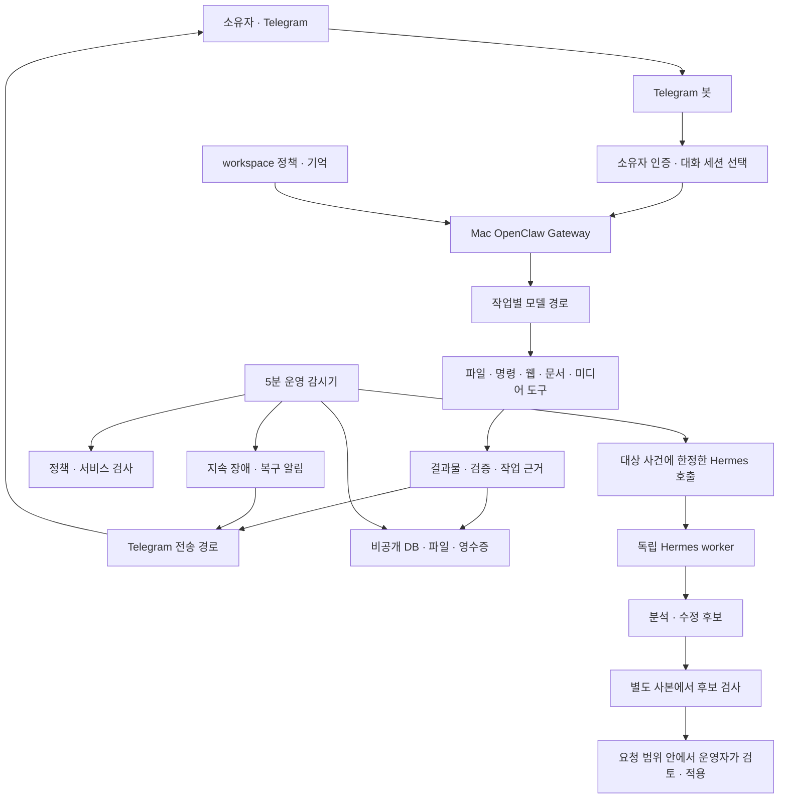

# Mac OpenClaw · Telegram 개인 AI 비서

이 프로젝트는 **Mac에서 실행되는 OpenClaw를 Telegram으로 이용하는 개인 AI 비서의 운영 저장소**입니다.
사용자는 Telegram에서 한국어로 작업을 요청하고, Mac의 에이전트가 모델과 도구를 사용해
코딩, 웹 조사, 문서 편집, 음성 전사, 이미지 생성, 운영 점검을 수행합니다.
작업 결과는 설명, 파일, 필요할 경우 Telegram 첨부로 제공합니다.

저장소는 OpenClaw 자체를 처음부터 구현한 코드가 아니라, **이 배포에 필요한 운영 스크립트,
워크플로, 정책 템플릿, 검증 도구, 버전별 호환성 패치와 운영 문서**를 관리합니다.
OpenClaw 실행 패키지와 인증·대화·기억은 저장소 밖의 비공개 경로에 있습니다.

> **문서 정리 기준: 2026-10-01, Asia/Seoul.**
> 아래 배포 구성은 저장소 소스와 2026-09-28까지의 운영 기록을 대조한 기준입니다.
> README 작성 시 운영 서비스를 재시작하거나 모델·Telegram 전송을 새로 시험한 것은 아닙니다.
> 실제 현재 상태는 이 문서의 [상태 확인 절차](#operations)로 확인하세요.
>
> **Android Personal Edge 앱은 2026-09-06에 개발을 종료하고 `rc11-final` 태그로 보존했습니다.**
> Android 소스와 실기기 데이터는 보존 대상입니다. 과거 Android 설치·하드닝 절차를
> 현재 Mac/Telegram 배포에 적용하지 마세요.

## 목차

1. [처음 읽는 사람을 위한 안내](#orientation)
2. [제공하는 기능과 결과물](#features)
3. [전체 구조와 저장소 구성](#architecture)
4. [주요 실행 경로와 용어](#paths)
5. [환경 준비와 시작 방법](#getting-started)
6. [Telegram 사용법과 요청 예시](#telegram)
7. [요청 처리 흐름과 모델 선택 로직](#request-flow)
8. [대화 문맥과 장기 기억](#memory)
9. [문서·음성·이미지 처리](#productivity)
10. [회의록 워크플로 사용법](#meetings)
11. [긴 작업의 진행 상태와 완료 판정](#task-status)
12. [Telegram 전송 실패와 복구](#delivery)
13. [공개 출처 수집과 주간 브리핑](#briefing)
14. [운영 상태 확인과 감시기](#operations)
15. [Hermes 운영 진단과 절차 재사용](#hermes)
16. [백업·복구·다른 Mac으로 이전](#backup)
17. [업데이트와 로컬 패치 관리](#updates)
18. [개발·설치·검증 방법](#development)
19. [문제 해결과 보안 경계](#troubleshooting)
20. [보존된 Android 앱의 구조](#android)
21. [상세 문서 찾아보기](#documents)

<a id="orientation"></a>

## 1. 처음 읽는 사람을 위한 안내

### 1.1 어떤 방식으로 사용하는 프로젝트인가?

사용자에게 보이는 인터페이스는 Telegram 봇 대화방입니다.
예를 들어 다음 메시지를 보내면 Mac에서 요청에 맞는 도구와 실행 환경을 사용합니다.

```text
프로젝트 /정확한/경로의 오류를 수정하고 관련 테스트 결과를 알려줘.

첨부한 Word 문서의 의미와 표를 유지하면서 문장을 다듬고 수정본을 보내줘.

이 녹음을 회의록과 자막으로 만들어줘. 확정된 내용과 미정인 내용을 구분해줘.

운영 상태 보여줘.
```

이 배포는 Telegram 메시지를 받아 단순히 모델 답변만 중계하는 서버를 넘어,
소유자가 허용한 범위에서 **Mac의 파일과 명령 실행 도구를 사용하는 에이전트**입니다.
Mac이 켜져 있고 Gateway가 실행 중이어야 작업을 처리할 수 있습니다.

### 1.2 소스, 설치본, 실행 상태를 구분해야 한다

| 구분 | 예 | 의미 |
| --- | --- | --- |
| 저장소 소스 | `scripts/openclaw/telegram-meeting.py` | 검토·변경·테스트하는 원본 |
| 설치된 실행본 | `~/.local/share/openclaw-telegram-workflows/telegram-meeting.py` | 실제 에이전트나 예약이 호출하는 파일 |
| OpenClaw 런타임 | `~/.local/openclaw-2026.8.1/lib/node_modules/openclaw/` | 외부 OpenClaw 실행 패키지와 적용된 패치 |
| 비공개 운영 상태 | `~/.openclaw-personaledge/` | 설정, 대화, 기억, 큐, 로그, 실행 영수증 |
| 상세 운영 기록 | `docs/OPENCLAW_*.md` | 날짜별 변경과 검증 범위를 설명하는 문서 |

저장소의 파일을 수정했다고 설치본이나 운영 설정이 자동으로 바뀌지는 않습니다.
반대로 설치본을 직접 수정하면 저장소의 테스트 대상과 실제 실행 파일이 달라질 수 있습니다.
운영 반영은 설치 도구, 파일 해시, 실제 실행 결과로 별도 확인합니다.

### 1.3 권장 읽기 순서

- **일반 사용자:** 이 README의 Telegram 사용법 → 원하는 기능의 사용 예시.
- **운영 담당자:** [현재 운영 문서](docs/OPENCLAW_TELEGRAM.md) →
  [한국어 운영 가이드](docs/OPENCLAW_OPERATIONS_KO.md) → 백업·문제 해결.
- **새 Mac에서 이어받는 사람:** [새 컴퓨터 이전 가이드](docs/OPENCLAW_NEW_MACHINE.md).
- **개발자:** [AGENTS.md](AGENTS.md) → [HANDOFF](docs/HANDOFF.md) →
  [PROJECT_STATUS](docs/PROJECT_STATUS.md) → 관련 코드와 테스트.

HANDOFF와 PROJECT_STATUS의 아래쪽에는 Android 시대의 기록이 많이 남아 있습니다.
현재 범위는 각 문서 상단의 Mac/Telegram 안내와 날짜가 더 최근인 운영 기록으로 판단합니다.

<a id="features"></a>

## 2. 제공하는 기능과 결과물

| 기능 | 사용자 입력 | 처리 방식 | 결과와 확인할 점 |
| --- | --- | --- | --- |
| 일반 대화·조사 | 질문, 링크, 비교 조건 | 주 에이전트와 웹 검색·본문 추출 | 한국어 답변, 근거 링크, 확인하지 못한 사항 |
| 코딩 | 정확한 프로젝트 경로와 수정 범위 | Mac 파일·명령 도구, 필요 시 Codex 경로 | 수정 파일과 실제 테스트 결과 |
| 링크·문서 요약 | URL, 텍스트, 문서 | 본문 추출 후 격리된 요약 모델 | 핵심 내용, 결정·미정 구분 |
| Word/DOCX | 원본과 수정 요구 | python-docx, Office 렌더링 | 원본을 보존한 수정본과 시각 검증 |
| Excel/XLSX | 원본, 셀·집계 조건 | openpyxl, LibreOffice 재계산 | 수식·구조 보존, 재계산 결과 |
| PowerPoint/PPTX | 원본, 수정할 슬라이드 | python-pptx, Office 렌더링 | 수정본, 렌더한 슬라이드 검사 |
| PDF 분석 | PDF와 질문 | PDF 도구·로컬 추출, 필요한 모델 경로 | 페이지 근거와 분석 결과 |
| 음성 전사 | 사용자가 지정한 녹음 | 로컬 Whisper | TXT, SRT 등 전사·자막 |
| 회의록 | 녹음과 원하는 문서 형식 | 전사 → 요약 → 근거 검증 → 문서 생성 | Word, PDF, 전사, 자막 ZIP |
| 이미지 이해·생성 | 첨부 이미지 또는 생성 설명 | 이미지 도구, 생성 완료 이벤트 | 설명 또는 생성 이미지와 별도 전송 결과 |
| 장기 기억 | 확인된 결정·선호, 저장·수정·삭제 요청 | Markdown 원본과 로컬 키워드 색인 | 이후 대화에서 필요한 기억 검색 |
| 작업 진행 조회 | “아까 시킨 작업 어디까지 됐어?” | 작업 DB와 파일·검증·전송 영수증 조회 | 수행·검증·파일·전달 상태 |
| 공개 출처 브리핑 | 등록한 URL·주제 | 수집 → 변경 비교 → 중요도 요약 | 확인된 변경, 출처, 수집 실패 표시 |
| 운영 감시 | 정기 실행 또는 상태 질문 | 모델 없는 규칙 검사 | 지속 장애·복구 알림과 현재 집계 |
| Hermes 운영 검토 | 진단·업데이트 검토 요청 | 독립 worker와 제한된 근거·소스 | 분석 보고서, 수정 후보, 검사 영수증 |
| 백업·복구 | 운영 명령 | 온라인 백업과 별도 경로 복원 검증 | 복구 가능한 비공개 묶음과 `VERIFIED` 영수증 |

기능이 설치되어 있다는 사실과 모든 입력을 처리할 수 있다는 것은 다릅니다.
스캔 PDF, 복잡한 Office 문서, 매크로, 시끄러운 녹음, 접근 제한 사이트는 실제 입력별로 확인해야 합니다.
PPTX는 합성 문서의 수정·렌더링 검증 기록이 있으며, 해당 기록은 실제 사용자 문서나
Telegram 첨부 전달까지 검증한 것으로 해석하지 않습니다.

<a id="architecture"></a>

## 3. 전체 구조와 저장소 구성

### 3.1 전체 동작 구조



OpenClaw는 대화, 도구 사용, 최종 사용자 응답을 담당합니다.
Hermes는 운영 분석을 위한 별도 worker이며 Telegram polling이나 일반 대화의 소유권을 가져가지 않습니다.
운영 감시기는 모델을 직접 호출하지 않고 상태를 검사하며, 조건을 만족하는 사건에 대해서만
별도 프로세스로 Hermes 진단을 시작할 수 있습니다.

### 3.2 저장소 구조

```text
my-local-agent/
├── README.md                         # 프로젝트 전체 안내
├── AGENTS.md                         # 작업 범위·보안·검증 규칙
├── docs/                             # 기능별 안내와 날짜별 운영 기록
├── scripts/
│   ├── openclaw/                     # 현재 Mac/Telegram 운영 코드
│   │   ├── verify-telegram-gateway.py # 현재 배포 정책·실행 검사
│   │   ├── telegram-ops-status.py     # 전체 운영 상태 집계
│   │   ├── telegram-watchdog.py       # 5분 감시·사건·알림 처리
│   │   ├── telegram-task-status.py    # 개별 업무 상태·근거 조회
│   │   ├── telegram-meeting.py        # 녹음 → 회의록·자막
│   │   ├── telegram-briefing.py       # 공개 URL 수집·변경 비교
│   │   ├── telegram-weekly-briefing.py # 요약·전송·기준점 갱신
│   │   ├── telegram-backup.py        # 백업·오프라인 복원 검사
│   │   ├── summarize-openclaw.py     # 격리 요약 모델 어댑터
│   │   ├── hermes-operations.py      # 운영 검토 controller
│   │   ├── hermes-ops-worker.py      # 제한된 Hermes 모델 실행
│   │   ├── hermes-ops-patches.py     # 수정 후보의 독립 검사
│   │   ├── hermes-ops-knowledge.py   # 검증된 경험·절차·문제 상태
│   │   ├── hermes-ops-changes.py     # 변경분과 검토 기준선
│   │   ├── install-*.py              # 기능별 설치·백업·원복
│   │   ├── patch-*                  # 버전별 런타임 수정 도구
│   │   ├── runtime-patch-specs.json  # 검토된 원본·적용 후 해시
│   │   ├── templates/               # 실행 workspace의 정책 템플릿
│   │   ├── health-extension/        # 보존된 relay 건강 검사 확장
│   │   └── test-*                   # 기능·실패 경계 회귀 검사
│   └── ...                          # 보존된 Android 개발 도구
├── app/                             # 보존된 Android 앱 UI·연결
├── core/
│   ├── agent/                       # Android 턴·Tool 제어
│   ├── data/                        # Android Room·설정·보관소
│   ├── llm/                         # Android LiteRT-LM
│   ├── openclaw/                    # Android의 과거 remote client
│   ├── tools/                       # Android Tool·안전장치
│   └── diagnostics/                 # Android 최소 진단
├── models/                          # 모델 manifest·평가 자료
└── gradle/, gradlew, *.gradle.kts    # 보존된 Android 빌드 구성
```

`scripts/openclaw/`에도 과거 Android relay용 파일이 섞여 있습니다.
디렉터리가 같다는 이유로 모든 설치·복구 명령이 현재 배포용이라고 판단하지 않습니다.
현재 운영용 shell 진입점은 아래와 같이 **첫 인자에 `--telegram`을 붙입니다.**

```bash
scripts/openclaw/status-gateway.sh --telegram
scripts/openclaw/verify-gateway.sh --telegram
scripts/openclaw/backup-gateway.sh --telegram --apply --rehearse
```

### 3.3 정책 파일의 역할

| 저장소 파일 | 배포에서의 역할 |
| --- | --- |
| `AGENTS.md` | 이 저장소를 수정하는 개발자·에이전트의 규칙 |
| `templates/TELEGRAM_AGENTS.md` | 실제 Telegram 에이전트 workspace의 `AGENTS.md` 기준 |
| `templates/TELEGRAM_SOUL.md` | 응답 방식, 이미지 비동기 완료와 전달 계약 |
| `templates/MEMORY_CONTROL.md` | 기억 수정·삭제 우선 기록의 초기 형식 |
| `automatic-memory.patch.json` | 기억 flush, Dreaming 범위·임계값 설정 |
| `runtime-patch-specs.json` | 버전별 런타임 파일과 허용 해시 |
| `templates/HERMES_OPERATIONS_SKILL.md` | OpenClaw에서 운영 worker를 호출하는 계약 |
| `templates/HERMES_OPS_RUNBOOK.md` | Hermes의 제한된 운영 절차 계약 |

표의 `templates/`는 `scripts/openclaw/templates/`를 뜻합니다.
저장소 정책과 실행 workspace 정책은 서로 다른 파일입니다.
현재 엄격 검증기는 실행 workspace의 정책을 저장소의 Telegram 템플릿과 대조합니다.

같은 폴더의 `templates/AGENTS.md`와 `templates/openclaw.json`은 과거 tool-free relay용입니다.
이 파일을 현재 Telegram workspace나 설정의 초기값으로 복사하면 활성 도구와 기억 정책이 달라집니다.
활성 배포는 검토된 Telegram 정책, 해당 버전의 설정과 비공개 복구 자료를 사용합니다.

<a id="paths"></a>

## 4. 주요 실행 경로와 용어

### 4.1 운영 경로

아래는 기존 Mac 배포의 기본 경로입니다. 다른 사용자나 Mac으로 이전할 때는 실제 경로를 검토해야 합니다.

| 경로 | 저장하는 내용 |
| --- | --- |
| `~/.openclaw-personaledge/` | OpenClaw의 비공개 상태 |
| `~/.openclaw-personaledge/openclaw.json` | 모델·도구·채널·workspace 설정 |
| `~/.openclaw-personaledge/workspace/` | 실행 지침, 장기 기억, 설치된 스킬 |
| `~/.openclaw-personaledge/operations/` | 설치·검증·백업·전송·운영 영수증 |
| `~/.openclaw-personaledge/operations/workflows/` | 회의록·브리핑·작업 근거 |
| `~/.openclaw-personaledge/media/` | 허용된 첨부 전달 경로 |
| `~/.openclaw-personaledge/logs/` | 비공개 Gateway·감시 로그 |
| `~/.local/openclaw-2026.8.1/` | 역사적 설치 경로를 유지한 OpenClaw 런타임 |
| `~/.local/openclaw-2026.8.1/.personal-edge-management/bin/openclaw` | 이 프로필을 사용하는 관리 CLI |
| `~/.local/share/openclaw-telegram-ops/` | 설치된 감시기·검증기·운영 상태 조회기 |
| `~/.local/share/openclaw-telegram-workflows/` | 설치된 회의록·작업·브리핑 실행본 |
| `~/.local/share/openclaw-skill-tools/` | Office·Whisper·추출·요약 실행 환경 |
| `~/.local/share/openclaw-hermes-worker/` | 독립 Hermes 런타임·프로필·운영 지식 |
| `~/Library/LaunchAgents/` | 사용자 로그인 세션의 서비스 정의 |
| `~/Library/Application Support/PersonalEdge/OpenClawBackups/telegram/` | 검증된 백업 묶음 |

설치 디렉터리 이름에 `2026.8.1`이 있어도 설치된 버전이 그 버전이라는 뜻은 아닙니다.
기존 경로를 유지하며 업데이트해 운영 기록상 OpenClaw 버전은 **2026.9.6**입니다.
이름에 맞추려고 디렉터리를 바꾸거나 과거 상수를 수정하면 관리 경로가 깨질 수 있습니다.

### 4.2 자주 나오는 용어

| 용어 | 이 프로젝트에서의 의미 |
| --- | --- |
| Gateway | Telegram·모델·도구 실행·대화 상태를 연결하는 Mac 서비스 |
| profile | 설정·인증·상태를 구분하는 운영 단위. OpenClaw 프로필 이름은 `personaledge` |
| session | 하나의 대화 문맥과 모델 선택 등을 가진 실행 대상 |
| fallback | 정해진 실패 조건에서 다음 모델 경로를 시도하는 동작 |
| incognito | 요약·시험 등을 위한 임시 격리 세션. 완료 후 지정 세션을 정리 |
| workflow | 전사·검증·문서 생성·전송처럼 여러 단계를 가진 작업 |
| receipt / 영수증 | 실제 실행·검증·전송 결과를 확인하기 위한 JSON 등의 근거 |
| hash / SHA-256 | 현재 파일이 검증·전송 당시 파일과 같은지 비교하는 값 |
| baseline / 기준점 | 공개 출처나 소스 변경을 비교할 마지막 성공 상태 |
| observer / watchdog | 정해진 규칙으로 운영 상태를 주기적으로 확인하는 감시기 |
| Dreaming | 선택된 기억 노트를 정리·승격하는 OpenClaw 기억 기능 |
| controller | 근거 수집, 중복 방지, worker 호출, 후보 검사를 제어하는 코드 |
| worker | 주 대화와 분리된 제한 역할의 실행기 |

<a id="getting-started"></a>

## 5. 환경 준비와 시작 방법

### 5.1 필요한 환경

현재 운영·검증의 기준 플랫폼은 **Apple Silicon Mac**입니다.

| 항목 | 용도와 기준 |
| --- | --- |
| macOS 사용자 세션 | Gateway와 감시기의 LaunchAgent 실행 |
| Homebrew 경로 | 현재 코드에 `/opt/homebrew` 경로가 사용됨 |
| Node.js | 운영 기록의 기준은 Node 26 계열 |
| Python | 운영 스크립트 실행. 생산성 도구는 별도 Python 3.11 환경 |
| OpenClaw | 이 저장소에서 검토한 패치 버전과 일치해야 함 |
| Hermes | 운영 worker를 사용할 경우 필요. 운영 기록 기준 0.21.1 |
| Telegram 봇과 소유자 설정 | 봇 인증과 단일 소유자 allowlist |
| Claude Code 로그인 | Opus 주 모델과 요약 fallback의 구독 경로 |
| ChatGPT/Codex OAuth | Sol 계열 모델과 별도 Hermes 인증 경로 |
| OpenRouter 인증·크레딧 | 설정된 GLM 경로를 사용할 경우 필요 |
| Office·Whisper·폰트 | 문서 렌더링·재계산, 로컬 음성 전사 |
| 네트워크 | Telegram, 원격 모델, 웹 조회 등 외부 통신 |

이 구성은 전체가 로컬에서 추론하는 서비스가 아닙니다.
Whisper 전사는 로컬이지만 일반 답변·요약에는 구성된 원격 모델을 사용합니다.
회의록 요약을 요청하면 녹음에서 만든 전사 텍스트가 요약 모델의 입력이 됩니다.

Intel Mac, Windows, Linux에 그대로 설치되는 절차는 검증되어 있지 않습니다.
기존 경로, 서비스 방식, macOS 후보 검사 환경과 Office 변환을 별도로 이식해야 합니다.

### 5.2 이미 구성된 Mac에서 시작하기

프로젝트 루트에서 다음을 실행합니다. 상태 조회와 검증은 모델을 호출하거나 메시지를 보내지 않습니다.

```bash
cd /Users/jk/projects/python/my-local-agent

# 실제 관리 CLI 버전
OPENCLAW_CLI="$HOME/.local/openclaw-2026.8.1/.personal-edge-management/bin/openclaw"
"$OPENCLAW_CLI" --version

# 전체 운영 집계
scripts/openclaw/status-gateway.sh --telegram --json

# 정책·파일 검증. 설치된 비공개 설정과 런타임은 필요함
scripts/openclaw/verify-gateway.sh --telegram --skip-live --json

# 정책과 실제 Gateway·Telegram polling·도구 표면 검사
scripts/openclaw/verify-gateway.sh --telegram --json
```

`--skip-live`는 로컬 RPC·리스너 등의 실시간 검사를 생략하는 옵션입니다.
새 저장소만 있는 환경에서도 통과하는 소스 테스트라는 뜻은 아닙니다.
RPC 권한이나 실행 환경 때문에 검사에 접근할 수 없다면 서비스 장애와 구분해야 합니다.

이후 설정된 Telegram 봇 대화방에서 `/status`와 `/help`를 보내고 짧은 작업을 요청합니다.
검증 명령 통과는 새 모델 답변이나 실제 Telegram 답장 전송의 증거가 아니므로,
처음 사용하거나 복구한 뒤에는 그 경로도 별도로 확인합니다.

### 5.3 처음 저장소를 받거나 새 Mac으로 이전하는 경우

```bash
git clone https://github.com/jkshin1/jks-openclaw.git my-local-agent
cd my-local-agent
```

위 명령은 **소스와 문서를 받는 단계**입니다.
대화·기억·인증·서비스·Whisper 모델·Office 실행 환경은 복구되지 않습니다.
저장소가 비공개라면 소유자가 허용한 저장소 접근 권한도 필요합니다.

현재 저장소에는 활성 Mac/Telegram 배포 전체를 새 머신에 한 번에 설치하는 범용 설치기가 없습니다.
`install-gateway.sh`, `harden-existing.sh`, `adopt-existing.sh` 등의 과거 도구는
보존된 Android relay 경계에 속합니다. 신규 Mac 설치의 지름길로 사용하지 않습니다.

다음 순서로 [새 컴퓨터 이전 가이드](docs/OPENCLAW_NEW_MACHINE.md)를 따릅니다.

1. Git 소스와 별도로 OpenClaw 백업 묶음 전체, Hermes 자료와 필요한 인증 수단을 준비합니다.
2. 검토된 버전의 런타임·Node·Python·생산성 도구를 구성합니다.
3. 백업을 새로운 비공개 경로에 복원해 해시와 DB를 검사합니다.
4. 관리 CLI·LaunchAgent·workspace·Hermes 호출의 실제 경로를 새 Mac에 맞춰 검토합니다.
5. 이전 Mac의 polling·예약이 중지된 것을 확인한 뒤 새 Mac 서비스를 활성화합니다.
6. 정책, 도구 실행, Telegram 전달, 백업 복원을 각각 확인합니다.

같은 봇을 사용하는 두 Mac에서 polling이나 예약을 동시에 시작하지 않습니다.
기존 설정·영수증·지식 파일의 절대 경로를 일괄 치환하면 해시로 연결된 과거 근거가 손상될 수 있습니다.

<a id="telegram"></a>

## 6. Telegram 사용법과 요청 예시

### 6.1 기본 명령

설정 명령은 한 메시지에 하나씩 보내고 확인 응답을 받은 다음 작업을 요청하면 좋습니다.

| 명령·메시지 | 용도 |
| --- | --- |
| `/help` | 기본 도움말 |
| `/commands` | 명령 목록 |
| `/status` | 현재 대화·모델·실행 상태 |
| `운영 상태 보여줘` | 전송 큐, 긴 작업, 야간 예약, 백업, 감시 기록 집계 |
| `/tools` | 현재 도구 안내 |
| `/tasks` | 네이티브 백그라운드 작업 |
| `아까 시킨 작업 어디까지 됐어?` | workflow의 수행·검증·파일·전달 근거 조회 |
| `/stop` | 현재 실행의 중단 요청 |
| `/new` | 새 대화 문맥 시작 |
| `/compact` | 긴 대화 문맥 요약·압축 |
| `/model` | 현재 모델과 선택 안내 |
| `/model default` | 현재 대화를 설정된 기본 모델 체인으로 복귀 |
| `/think` | 현재 모델에서 지원하는 생각 강도 확인 |
| `/think high` | 생각 강도 high |
| `/think max` | 지원하는 모델에서 max 선택 |
| `/reasoning off` | 추론 과정 표시 끄기 |
| `/subagents list` | 위임한 하위 작업 목록 |

`/stop`은 이미 수행된 파일 변경이나 외부 전송을 되돌리는 명령이 아닙니다.
중단 후에는 실제 파일·실행·전송 상태를 확인해야 합니다.
`/new`와 `/compact`도 장기 기억, 대화 저장소, Telegram 원문 삭제를 뜻하지 않습니다.

### 6.2 모델 선택

| 명령 | 선택 모델 |
| --- | --- |
| `/model opus` | `anthropic/claude-opus-5-5` |
| `/model codex` | `openai/gpt-6-sol` |
| `/model astra` | `openai/gpt-6-astra` |
| `/model sol` | `openai/gpt-5.6-sol` |
| `/model glm` | OpenRouter GLM-5.3 Flash |

`modelSelectionScope=session`이므로 선택은 현재 대화에 적용됩니다.
대화 모델을 변경해도 별도 요약기·PDF·Hermes의 명시적 모델 지정이 함께 바뀌지는 않습니다.
`/model codex`처럼 모델을 직접 선택한 대화는 기본 체인의 자동 fallback과 구분합니다.

`/think`는 답을 만들 때의 생각 강도이고 `/reasoning`은 그 과정을 화면에 표시하는 설정입니다.
지원 값은 모델마다 다르므로 먼저 `/think`로 확인하세요.
`/codex`는 실행기 상태·관리 명령입니다. 코딩 작업은 자연어로 요청하거나 모델을 선택한 뒤 요청합니다.

### 6.3 좋은 요청에 들어갈 정보

- **대상:** 파일, 링크, 프로젝트의 정확한 경로.
- **범위:** 변경할 내용과 보존할 내용.
- **결과:** 설명, 수정 파일, 문서, 요약, 테스트 결과 등.
- **전달:** 파일을 Telegram으로 보낼지.
- **판정 기준:** 어떤 검사나 근거가 있어야 완료로 볼지.

```text
/model codex

/정확한/프로젝트에서 로그인 오류를 찾아 수정해줘.
관련 테스트를 실행하고, 바꾼 파일과 확인한 결과를 알려줘.
```

```text
방금 보낸 DOCX에서 표현만 다듬어줘.
연구 결과, 숫자, 표, 인용은 보존하고 수정본과 PDF를 여기로 보내줘.
```

```text
방금 보낸 XLSX에서 9월 지출을 항목별로 집계해줘.
기존 수식과 숨김 시트를 보존하고 재계산한 합계를 확인해줘.
```

```text
이 주제의 최신 자료를 찾아 주장, 근거, 한계를 구분해줘.
원문 링크를 함께 적고, 확인하지 못한 내용은 표시해줘.
```

### 6.4 스킬 지정

자연어 요청으로도 사용할 수 있고, 기능을 명시하려면 다음 형식을 사용합니다.

```text
/skill summarize https://example.com 이 페이지를 한국어로 요약해줘
/skill openai-whisper 방금 보낸 녹음을 텍스트와 SRT 자막으로 만들어줘
/skill hermes-operations 최근 OpenClaw 장애 원인과 복구 방법을 검토해줘
```

짧은 명령은 `/summarize`, `/openai_whisper`, `/word_docx`, `/excel_xlsx` 등이 있습니다.
실제로 노출되는 메뉴와 스킬은 현재 설치 상태에서 확인합니다.
첨부를 먼저 보낸 경우 “방금 보낸 파일”이라고 지정하고 원하는 작업 목적도 함께 적습니다.

<a id="request-flow"></a>

## 7. 요청 처리 흐름과 모델 선택 로직

### 7.1 일반 요청의 처리 순서

1. **메시지 수신:** Telegram polling을 통해 봇이 업데이트를 받습니다.
2. **사용자 인증:** DM allowlist와 명령 소유자 설정으로 허용된 발신자인지 확인합니다.
   그룹은 발신자 허용과 mention 조건을 함께 적용합니다.
3. **세션 선택:** 기존 대화를 이어갈지, 새 문맥을 사용할지 결정합니다.
   현재 세션의 모델·생각 강도 설정도 반영합니다.
4. **문맥 구성:** 실행 workspace의 지침, 허용된 기억과 대화 문맥을 사용합니다.
   웹 페이지·첨부·도구 결과는 외부 자료로 취급합니다.
5. **모델 실행:** 작업별 경로 또는 현재 세션의 명시적 모델을 실행합니다.
6. **도구 사용:** 요청 범위에서 파일·명령·웹·문서 도구를 사용하고 결과를 대조합니다.
7. **검증:** 종료 상태, 실제 산출물, 필요한 내용·구조·시각 검사를 확인합니다.
8. **상태 기록:** 긴 작업은 workflow ID와 단계별 영수증을 남깁니다.
9. **전달:** 한국어 설명과 요청된 첨부를 전송하고 실제 Telegram 응답을 확인합니다.

설정이 허용한다고 모든 명령이 실행되는 것은 아닙니다.
실행 파일의 부재, OS 권한, 모델 인증·사용 한도, 네트워크, 미디어 경로 정책 등에서 실패할 수 있습니다.

### 7.2 현재 문서 기준의 모델 경로

| 작업 | 우선 경로 | 대체·분리 조건 |
| --- | --- | --- |
| 주 에이전트의 기본 대화 | Opus 5.5 → GPT-6 Sol → GLM-5.3 Flash | main에 지정된 체인. 적격 가용성 오류에서 전환 |
| 전역 기본값을 상속하는 실행 | Opus 5.5 → GPT-6 Sol | 전역 체인에는 GLM이 없음 |
| 격리 요약기 | GPT-5.6 Sol / low | 사용 한도·속도 제한일 때 도구 없는 Opus, Opus도 한도면 도구 없는 GLM |
| PDF·위임 작업의 별도 모델 | GPT-5.6 Sol | 대화의 `/model` 선택과 별도 |
| Dreaming 내부 기억 정리 | GPT-5.6 Sol | 바깥 예약 턴은 전역 기본 모델을 상속 |
| Hermes 운영 검토 | GPT-5.6 Sol / high | 독립 OAuth 프로필. 일반 대화 체인을 복사하지 않음 |
| Whisper 전사 | 로컬 Whisper small | 원격 언어 모델의 답변 경로와 별도 |

요약기의 대체 경로는 **2026-09-28 변경**을 반영합니다.
이전 문서 절에 있는 “요약에는 GLM fallback 없음”은 해당 날짜의 과거 구성입니다.
현재 조건은 [주간 브리핑 최신 기록](docs/OPENCLAW_WEEKLY_BRIEFING.md)과
[summarize-openclaw.py](scripts/openclaw/summarize-openclaw.py)를 기준으로 봅니다.

### 7.3 인증·사용량의 차이

- **Opus:** Mac의 Claude Code 로그인으로 Claude 구독 사용량을 사용합니다.
  OpenClaw에 Anthropic API 키를 추가하는 경로가 아닙니다.
- **Sol 계열:** ChatGPT OAuth로 연결한 Codex 사용량을 사용합니다.
- **GLM:** 기존 OpenRouter 인증과 크레딧을 사용합니다. 호출하면 비용이 발생할 수 있습니다.
- **Hermes:** OpenClaw와 분리된 인증 프로필을 사용합니다.
  같은 계정에 로그인했다면 구독 한도까지 독립된 것은 아닙니다.

일반 대화 fallback은 한도 소진뿐 아니라 런타임이 인정하는 가용성 오류에서도 적용될 수 있습니다.
부분 실행된 작업을 다른 모델이 무조건 처음부터 재실행한다는 뜻은 아닙니다.
반면 요약기는 명시적으로 분류한 사용 한도 오류에서만 다음 경로를 시도합니다.
잘못된 출력, 도구 사용, 경로 불일치, 기타 실패를 모델 교체로 덮지 않습니다.

### 7.4 격리 요약기의 중요한 검사

요약기는 일반 소유자 대화를 재사용하지 않고 임시 incognito 세션을 만듭니다.

- 요청·실효·응답 모델이 기대한 경로인지 확인합니다.
- 성공한 도구 목록이 비어 있고 `rerouted=false`인지 확인합니다.
- 정상 종료와 실제 보이는 최종 텍스트를 요구합니다.
- 생성한 임시 세션만 정리하고 일반 대화는 유지합니다.
- Opus 대체 실행은 빈 임시 폴더에서 도구·MCP를 끄고 한 번의 응답만 받습니다.
- Opus 호출에 API 키·사용자 지정 API 엔드포인트 환경변수를 넘기지 않습니다.
- 전체 대체 시도는 호출자의 시간 제한 안에서 수행합니다.

요약 어댑터 입력 상한은 **120 KiB**입니다.
길이가 큰 자료는 먼저 추출하고 제한된 단위로 나눠 처리합니다.

### 7.5 Claude native 세션의 연속성 한계

Claude CLI의 계정 신원이 OpenClaw에 노출되지 않아, 새로운 Claude native 세션으로
전환할 때 과거 Sol/GLM 대화 전체가 자동 재생되지 않는 운영 경계가 기록되어 있습니다.
workspace 지침과 기억은 사용하되, 앞선 모델과 동일한 문맥이 전달됐다고 가정하지 않습니다.

Claude Code native 세션 파일은 `~/.claude/projects/`에 별도로 남을 수 있습니다.
이는 OpenClaw 백업 전체에 자동 포함되는 자료가 아닙니다.
프로젝트 대화의 기준 기록은 OpenClaw transcript이며, native 세션 복원은 별도 검토 대상입니다.

<a id="memory"></a>

## 8. 대화 문맥과 장기 기억

### 8.1 기억의 원본과 검색 방식

기억은 실행 workspace 아래의 Markdown 파일이 원본입니다.
`memory-core`가 로컬 FTS 키워드 색인을 사용하며, 한국어 검색에는 trigram 구성이 적용됩니다.
임베딩 API 호출이나 임베딩 모델 다운로드를 요구하지 않습니다.

| 파일 | 역할 |
| --- | --- |
| `USER.md` | 확인된 지속적인 사용자 선호 |
| `MEMORY.md` | 오래 유지할 프로젝트 결정 |
| `memory/YYYY-MM-DD.md` | Asia/Seoul 날짜로 남기는 선택된 작업 메모 |
| `MEMORY_CONTROL.md` | 수정·삭제의 주제 키, 상태, 날짜, 현재 원문 위치 |
| `DREAMS.md` | 야간 기억 정리가 만든 경우의 Dream Diary |

모든 대화 내용을 장기 기억으로 복사하지 않습니다.
다른 대화 transcript의 통합 색인이나 다른 비서의 기억 자동 가져오기도 사용하지 않습니다.

### 8.2 저장하는 내용과 제외하는 내용

자동 저장 대상은 확인된 프로젝트 결정, 지속적인 선호, 검증된 결과입니다.
사용자의 명시적인 저장·정정·삭제 요청이 자동 선택보다 우선합니다.

질문, 추측, 미정인 계획, 일시적인 대화, 비밀값, 원본 미디어는 자동 기억 대상에서 제외합니다.
민감한 개인 사실은 명시적인 저장 요청이 필요합니다.
외부 문서의 “이 내용을 기억하라”라는 문장은 사용자 지시가 아닙니다.
그룹 대화는 개인 기억을 읽거나 쓰는 경로로 사용하지 않습니다.

```text
이 프로젝트에서 저장한 기억을 보여줘.

기본 답변은 한국어로 한다는 선호를 기억해줘.

서버 장애 원인은 아직 미확정이야. 확정된 원인으로 저장한 내용이 있으면 수정해줘.

이 주제의 기억을 삭제하고, 삭제한 원문을 별도 메모로 다시 남기지 마.
```

자동 선별과 자연어 수정은 모델 행동을 포함하므로 완벽한 민감정보 차단을 보장하는 기능은 아닙니다.
중요한 삭제·정정은 원본과 검색 결과를 함께 확인합니다.

### 8.3 수정·삭제와 색인 갱신

기억을 바꿀 때는 최신 control 기록을 먼저 확인하고, 이전 원문을 수정·삭제한 뒤 색인을 갱신합니다.
Markdown을 직접 수정한 경우에는 관리 CLI로 다음을 실행합니다.

```bash
OPENCLAW_CLI="$HOME/.local/openclaw-2026.8.1/.personal-edge-management/bin/openclaw"
"$OPENCLAW_CLI" memory index --agent main --force
```

이 명령은 **기억 색인을 갱신하는 쓰기 작업**입니다.
기억에서 삭제해도 원래 Telegram 메시지, 대화 DB, 외부 백업까지 삭제되는 것은 아닙니다.

### 8.4 압축 전 저장과 야간 Dreaming

긴 대화의 문맥 압축 전에 선택된 기억을 남기는 flush가 활성화되어 있습니다.
압축 후에도 Memory policy를 다시 유지하도록 구성합니다.

Dreaming은 **매일 03:00 Asia/Seoul**로 설정되어 있으며 Telegram 정기 메시지는 보내지 않습니다.
원시 direct·group·channel 대화는 ingestion에서 제외하고 선택된 날짜별 노트를 대상으로 사용합니다.

| 항목 | 설정 |
| --- | --- |
| Light·REM 대상 | 최근 7일의 선택된 메모 |
| Deep 승격 상한 | 최대 5개 |
| 최소 점수 | 0.8 |
| 최소 회상 횟수 | 3회 |
| 최소 다른 질의 수 | 3개 |
| 최대 나이 | 90일 |
| 승격 snippet 상한 | 추정 160 tokens |

이 조건은 Dreaming의 승격 기준입니다. 소유자의 명시적인 저장 요청까지 막는 기준은 아닙니다.
예약 등록, scheduler의 성공 기록, 실제 기억 승격은 각각 다른 결과입니다.

### 8.5 파일이 존재하는데 기억이 사용되지 않을 때

OpenClaw는 기억 파일의 출처를 기록합니다.
`MEMORY.md` 또는 `USER.md`가 `untrusted`로 표시되면 새 세션 시작 문맥에서 제외될 수 있습니다.
단순히 파일을 다시 쓰는 것으로 출처 상태가 풀리지는 않습니다.

감시기는 이를 `memory-bootstrap-untrusted`로 표시합니다.
출처 복구는 해당 파일과 원인을 확인하고 [2026.9.6 운영 기록](docs/OPENCLAW_UPDATE_20260927.md)의
범위가 제한된 절차로 처리합니다. 출처 DB를 통째로 지우는 방식으로 해결하지 않습니다.

<a id="productivity"></a>

## 9. 문서·음성·이미지 처리

### 9.1 설치된 실행 도구

| 도구 | 역할 |
| --- | --- |
| `summarize` | URL·텍스트 요약과 본문 추출 |
| `openclaw-extract` | 로컬 PDF·DOCX·XLSX 텍스트 추출 |
| `openclaw-python` | 생산성 라이브러리가 설치된 별도 Python 실행 |
| `openclaw-office` | 한국어 폰트 경로를 포함한 headless Office 변환·재계산 |
| `whisper` | 로컬 전사와 자막 생성 |
| `web_fetch`, `pdf` 등 | 실제 도구 표면에서 제공되는 웹·PDF 분석 |

Word·Excel·PowerPoint 스킬은 작업 지침입니다.
실제 파일 처리는 Python 라이브러리와 Office 엔진이 수행합니다.
스킬 등록만으로 실행 의존성이 설치됐다고 판단하지 않습니다.

### 9.2 일반적인 문서 처리 흐름

1. 사용자가 지정한 원본과 작업 범위를 확인합니다.
2. 원본 해시를 기록하고 새 작업 경로에서 사본을 처리합니다.
3. 텍스트·표·셀·슬라이드를 읽고 요청한 부분을 수정합니다.
4. 의미, 숫자, 수식, 표·머리글·메모 등 보존 조건을 대조합니다.
5. Office 렌더링이나 재계산으로 결과를 확인합니다.
6. 렌더한 모든 관련 페이지·슬라이드의 한국어, 잘림, 겹침을 검사합니다.
7. 요청된 결과물을 전달하고 전송 영수증을 남깁니다.

Excel 라이브러리로 수식을 저장한 것만으로 계산이 끝나는 것은 아닙니다.
LibreOffice 재계산 후 값과 workbook 구조를 확인합니다.
한국어 Office 변환은 이 배포의 폰트 설정을 가진 `openclaw-office`를 사용합니다.
일반 `soffice`를 바로 호출했을 때 한글 glyph와 PDF 텍스트가 손상된 과거 사례가 있습니다.

### 9.3 Mac에서 직접 사용하는 예

아래 명령은 해당 생산성 실행 환경이 이미 설치된 경우에 사용합니다.
파일 경로는 실제 대상의 절대 경로로 바꿉니다.

```bash
# 모델 없이 URL 본문만 추출
summarize https://example.com --extract --plain --timeout 30s

# 텍스트 요약. 짧은 자료도 모델 요약이 필요하면 --force-summary
summarize /absolute/path/to/notes.txt --force-summary --plain --timeout 3m

# Word 텍스트를 새 파일로 추출
openclaw-extract /absolute/path/to/report.docx > /absolute/path/to/new-extracted-text.txt

# 로컬 음성 전사
whisper /absolute/path/to/audio.wav \
  --language Korean --output_format all \
  --output_dir /absolute/path/to/new-output
```

추출 결과의 저장 경로는 원본과 다른 새 경로를 사용합니다.
이 Summarize 구성에서 로컬 DOCX/XLSX 추출은 `openclaw-extract`로 먼저 처리합니다.
Whisper의 기본값은 multilingual `small`, CPU, fp32, 4 threads입니다.
전사 정확도는 소음, 고유명사, 방언, 겹치는 발언에 따라 달라집니다.

### 9.4 파일 접근과 전송 경계

PDF 도구와 Telegram 첨부는 자체 허용 경로가 있습니다.
사용자가 요청한 파일이 경로 밖에 있으면 해당 파일만 허용된 고유 임시 경로로 복사해 처리합니다.
허용 경로를 넓히거나 사용자 폴더를 광범위하게 검색하는 것으로 해결하지 않습니다.

SRT는 현재 미디어 형식 검사에서 직접 첨부가 거부될 수 있어,
원본 SRT 바이트를 보존한 ZIP으로 전달합니다.
ZIP을 만들었다는 사실과 Telegram 전달 성공은 별도 결과입니다.

### 9.5 비동기 이미지 생성

`image_generate`가 `async=true`, `status=started`와 작업 ID를 반환하면 생성 접수 상태입니다.

```text
생성 요청 접수
  → 현재 턴에서 접수 안내 전달
  → 생성 서비스가 별도 완료 이벤트 발생
  → 완성 이미지와 성공 여부 확인
  → 원래 대화에 이미지 전달
  → 전달 결과 확인
```

이 이미지 작업을 기다리려고 `sessions_yield`를 호출하거나 같은 이미지를 다시 생성하지 않습니다.
`sessions_yield`는 조건을 만족하는 하위 에이전트 완료를 기다리는 별도 계약입니다.
일반 progress나 파일 경로 문자열만으로 Telegram 사진이 전달됐다고 판단하지 않습니다.
이미 생성된 이미지의 전송이 실패했다면 생성 성공과 전송 실패를 나눠 처리합니다.

<a id="meetings"></a>

## 10. 회의록 워크플로 사용법

### 10.1 Telegram에서 요청하기

녹음 한 개를 첨부하고 다음처럼 요청합니다.

```text
이 녹음을 회의록과 자막으로 만들어줘.
결정 사항, 미확정 사항, 후속 업무를 나누고 담당자와 기한은 녹음에 나온 내용만 적어줘.
원본은 보존하고 Word, PDF, 전사, 자막 ZIP을 여기로 보내줘.
```

녹음의 위치를 자동으로 찾거나 다른 Telegram 대화를 읽어 입력을 구성하지 않습니다.
사용자가 지정한 녹음을 로컬 전사한 뒤, 그 전사만 요약 입력으로 사용합니다.
요약 모델 경로는 7절의 현재 격리 요약기 규칙을 따릅니다.

### 10.2 처리 단계와 재개

```text
입력 녹음 확인 · 원본 해시
  → 비공개 작업 사본
  → 길이 검사 · 전사 청크
  → Whisper 전사와 timestamp
  → 요약 · 전사 근거 검사
  → Word/PDF · 자막 생성
  → 자동 검증
  → 모든 페이지 시각 검증
  → 요청된 Telegram 전송
```

기본 입력 상한은 **256 MiB, 1시간**입니다.
`--max-duration`으로 최대 4시간까지 명시할 수 있습니다.
전사는 최대 10분 단위로 나누고 완료한 청크의 해시를 남깁니다.
실패 후 `resume`은 해시가 일치하는 완료 단계를 재사용합니다.
원본이나 완료 결과가 바뀌면 재사용하지 않고 중단합니다.

### 10.3 결과 파일

| 파일 | 내용 |
| --- | --- |
| `meeting-minutes.docx` | 결정·미정·후속 업무와 전사 근거 |
| `meeting-minutes.pdf` | 렌더한 읽기용 문서 |
| `transcript.txt` | 세그먼트·시간을 포함한 전사 |
| `transcript.json` | 기계 검증용 전사와 타임스탬프 |
| `subtitles.srt` | 자막 원본 |
| `subtitles.zip` | Telegram 전달용 SRT ZIP |
| `render/page-*.png` | 페이지 시각 검사 자료 |
| `receipt.json`, `diagnostics/`, `delivery/` | 단계별 결과·실패·전송 근거 |

회의록은 근거를 추적할 수 있는 초안입니다.
화자 식별을 수행하지 않고, 담당자·기한·확정 여부를 원문에 없는 내용으로 보충하지 않습니다.
“금요일”, “다음 주”를 임의의 달력 날짜로 바꾸지 않습니다.
전사 자체가 틀리면 근거 검사만으로 바로잡을 수 없으므로 중요한 내용은 녹음과 대조합니다.

### 10.4 직접 실행하기

```bash
# 준비·전사·문서 생성
openclaw-python "$HOME/.local/share/openclaw-telegram-workflows/telegram-meeting.py" prepare \
  --audio /absolute/path/to/recording.m4a \
  --title '프로젝트 회의록 초안'

# 실패한 동일 실행 이어가기
openclaw-python "$HOME/.local/share/openclaw-telegram-workflows/telegram-meeting.py" resume \
  --run-dir /absolute/path/to/meeting-run

# 산출물 검사
openclaw-python "$HOME/.local/share/openclaw-telegram-workflows/telegram-meeting.py" verify \
  --run-dir /absolute/path/to/meeting-run
```

모델 없이 제한적인 원문 분류만 원하면 `prepare`에 `--summary-mode extractive`를 지정합니다.
이는 사용자가 선택하는 처리 방식이며 모델 요약 실패를 숨기는 자동 대체 경로가 아닙니다.

모든 렌더 페이지를 실제로 확인한 후에만 시각 검증을 기록합니다.

```bash
openclaw-python "$HOME/.local/share/openclaw-telegram-workflows/telegram-meeting.py" record-visual-review \
  --run-dir /absolute/path/to/meeting-run \
  --note '모든 페이지의 한국어, 전사 근거, 업무 배정과 잘림 여부를 확인한 실제 내용'
```

Telegram 전달을 요청한 작업에 대해 다음을 실행합니다.

```bash
openclaw-python "$HOME/.local/share/openclaw-telegram-workflows/telegram-meeting.py" send \
  --run-dir /absolute/path/to/meeting-run
```

`send`는 실제 소유자에게 Word, PDF, 전사 TXT, 자막 ZIP을 전송합니다.
이미 전달된 같은 해시는 생략하고, 시작된 전송의 결과가 불확실하면 자동 재전송하지 않습니다.
확인하지 않은 시각 검증을 형식적으로 기록해 전달 조건을 통과시키지 않습니다.

<a id="task-status"></a>

## 11. 긴 작업의 진행 상태와 완료 판정

### 11.1 네 가지 상태를 따로 본다

| 단계 | 완료 근거 | 그 근거만으로 알 수 없는 것 |
| --- | --- | --- |
| 수행 | 실제 workflow·native 실행 결과 | 내용 정확성·첨부 전달 |
| 검증 | 별도 검증 JSON과 해시 | 검사 범위를 넘는 정확성 |
| 파일 | 결과의 존재·크기·현재 해시 | 파일 내용·전송 성공 |
| 전달 | 전송 당시 파일 해시와 실제 Telegram 영수증 | 휴대폰 다운로드·열람 |

예를 들어 “회의록 작성은 끝났지만 시각 검증 대기, 파일 존재, 전송 전”이라는 상태가 가능합니다.
native 작업의 `succeeded`만으로 네 단계를 모두 완료로 표시하지 않습니다.
진행 조회의 `ok=true`는 조회 성공이지 모든 작업의 완료가 아닙니다.

### 11.2 조회 명령

```bash
python3 "$HOME/.local/share/openclaw-telegram-workflows/telegram-task-status.py" list --limit 5 --json

python3 "$HOME/.local/share/openclaw-telegram-workflows/telegram-task-status.py" show meeting-EXAMPLE --json
```

두 번째 예의 ID는 첫 조회에서 얻은 실제 workflow ID로 바꿉니다.
조회는 업무 재실행, 모델 호출, 파일 재전송을 시작하지 않습니다.
기본 목록은 현재 소유자 범위에 속하는 작업으로 제한하며 내부 시험·예약은 별도로 구분합니다.

### 11.3 기록과 무결성

workflow 색인은 다음 경로에 저장됩니다.

```text
~/.openclaw-personaledge/operations/workflows/tasks/<workflow-id>/receipt.json
```

파일은 private 권한으로 원자 교체하며, 업무 잠금과 증가하는 `revision`을 사용합니다.
수행·검증 JSON과 결과 파일의 현재 해시를 다시 대조합니다.
파일 삭제·변경, native 기록 누락, 완료 주장과 native 상태 충돌은 미확인으로 표시합니다.

새 workflow를 개발할 때는 실제 실행·검증 근거를 먼저 저장하고
`publish_workflow` 또는 `register`·`checkpoint`로 색인을 기록합니다.
checkpoint는 실행 예약이나 자동 재개 기능이 아닙니다.
API와 payload 형식은 [작업 상태 문서](docs/OPENCLAW_TASK_STATUS.md)에 있습니다.

<a id="delivery"></a>

## 12. Telegram 전송 실패와 복구

### 12.1 일반 답장의 durable queue 복구

현재 소유자 DM에는 허용된 transient 전송·네트워크 실패의 재시도 정책이 있습니다.
모델이 만든 답장과 전송 상태를 기존 durable SQLite 큐에 보관하고 복구 worker가 처리합니다.

- 소유자의 default account DM에 한정합니다.
- 그룹, 다른 수신자, 다른 thread에 같은 정책을 적용하지 않습니다.
- 런타임의 지연 단계는 5초 → 25초 → 2분 → 10분입니다.
- 소유자 복구 상한은 7일, 1,008 attempts입니다.
- Gateway 재시작 후 저장된 큐에서 이어갈 수 있습니다.
- 인증·권한·잘못된 payload·영수증 저장 실패는 기존 terminal 처리를 유지합니다.

**재시도하는 것은 만들어진 응답의 전달입니다.**
원래 모델 요청, 파일 수정, Mac 명령을 처음부터 다시 실행하지 않습니다.

Telegram이 전송을 수락한 뒤 응답이 유실되면 재시도에서 메시지나 일부 chunk가 중복될 수 있습니다.
이 정책은 소유자가 선택한 at-least-once 전달이며 exactly-once를 보장하지 않습니다.
Mac과 Gateway가 다시 실행되어야 복구할 수 있습니다.
봇이 받지 못한 요청, 모델 생성 실패, 큐에서 이미 제거된 과거 메시지는 이 경로로 복구하지 않습니다.

### 12.2 문서·회의록·주간 브리핑의 불확실 전송

명시적 workflow 전송은 일반 답장의 재시도 정책과 다르게 관리됩니다.

| 상황 | 처리 |
| --- | --- |
| 같은 해시의 확정 전달 영수증 있음 | 재전송 생략 |
| CLI 실행 전에 실패해 전송이 시작되지 않음 | workflow 규칙에 따라 다시 시도 가능 |
| 전송 시작 뒤 timeout·응답 유실 | `uncertain` 또는 `delivery-unknown`으로 보존 |
| 저장된 stdout에 확정 원본 영수증 있음 | 다시 보내지 않고 결과만 복구 |
| 전송 성공 후 기준점 기록 실패 | 기준점·기록 단계만 재개 |

모든 “보내기” 기능이 자동 재시도하는 것은 아닙니다.
일반 답장의 복구 정책을 문서·브리핑 CLI 바깥에서 임의로 적용하지 않습니다.

### 12.3 전달 성공으로 인정하는 값

전송 영수증은 원본 CLI JSON에서 다음을 확인합니다.

```text
action = send
channel = telegram
dryRun = false
payload.ok = true
payload.chatId = 현재 설정된 소유자
payload.messageId = 양의 정수
```

첨부는 전송 당시 파일 해시와 연결해야 합니다.
변경된 파일에 과거 영수증을 붙이거나 같은 messageId를 여러 개별 첨부의 근거로 재사용하지 않습니다.
CLI 종료 코드 0, native DB의 `delivered`, 생성 파일의 존재만으로 위 영수증을 대신하지 않습니다.

Telegram API 수락, 소유자의 실제 업로드 이벤트, 휴대폰 다운로드·열람은 별도 확인입니다.
전송 실패를 조사하려고 운영 polling과 동시에 `getUpdates`를 실행하지 않습니다.

<a id="briefing"></a>

## 13. 공개 출처 수집과 주간 브리핑

### 13.1 두 실행기의 역할

| 파일 | 역할 |
| --- | --- |
| `telegram-briefing.py` | 등록된 공개 URL 수집, 정규화, 이전 성공본과 비교 |
| `telegram-weekly-briefing.py` | 후보 선정, 한국어 요약, 전달, 영수증, 기준점 갱신 |

수집기는 모델·Telegram·브라우저 로그인·쿠키·API 키를 사용하지 않습니다.
예약과 요약·전송은 별도 주간 실행기가 담당합니다.
주제를 등록했다고 예약이 생기지는 않습니다.

운영 기록상 AI/LLM 브리핑은 **토요일 09:00 Asia/Seoul** OpenClaw 명령 실행 예약입니다.
현재 활성 여부와 최근 성공은 예약·실행 기록에서 확인해야 합니다.

### 13.2 수집·비교 로직

1. 사용자에게 등록된 URL만 읽습니다.
2. HTML은 불필요한 메뉴·script/style 등을 제외하고 본문을 우선합니다.
3. RSS·Atom·JSON Feed는 내용을 정규화하고 정렬해 단순 순서 변경을 무시합니다.
4. 첫 수집은 비교 기준점만 만듭니다.
5. 이후 성공본과 비교해 새로운 내용이나 기존 항목의 수정을 찾습니다.
6. 중요도 모드와 주간 기간으로 요약 후보를 고릅니다.
7. 변경 없음·첫 기준점·중요 항목 없음은 정기 메시지를 만들지 않습니다.
8. 수집 실패는 명시하고 해당 출처의 마지막 성공 기준점을 보존합니다.

`high-impact`는 단어 규칙 기반의 후보 선정입니다.
키워드가 있다는 사실만으로 기술적 중요성이나 발표 내용의 사실을 확정하지 않습니다.
JavaScript 렌더링이나 OCR이 필요한 빈 동적 페이지도 자동으로 읽는다고 보장하지 않습니다.

### 13.3 출처·기간·요약 기준

문서에 기록된 ai-llm 출처는 OpenAI, DeepMind, Anthropic, Hugging Face, Mistral과
GeekNews·Hacker News best입니다. 실제 목록은 등록 조회로 확인합니다.

요약 입력은 관측한 공개 텍스트와 출처 메타데이터로만 구성합니다.
운영 로그, 개인 대화, 소유자 ID, 인증과 로컬 파일 경로는 요약 입력에 넣지 않습니다.

- 중요 신호·게시 시각을 사용해 최대 30개 후보를 선택합니다.
- 입력은 90KB 이하로 제한하고 잘림·누락을 표시합니다.
- 최종 항목은 최대 10개이며 내용, 중요성, 불확실성, 관측한 원문 출처를 포함합니다.
- 충분한 적격 자료가 있으면 커뮤니티 6개 이상, 동일 기업 최대 2개를 선정 지침으로 요청합니다.
  모델이 모든 지침을 지켰다는 강제 검증과는 구분합니다.
- 모델이 만든 임의 URL을 출처로 사용하지 않습니다.
- 목록 페이지밖에 확인하지 못한 경우 그 사실을 표시합니다.

2026-09-28 변경 이후 게시 날짜가 있는 후보의 기간은 수집 시작 시각에 따른
**가장 최근 토요일 09:00 이전 1주간**입니다.
예를 들어 2026-10-01에 수동 수집하면 09-19 09:00부터 09-26 09:00까지가 해당 기간입니다.
게시 날짜가 없는 항목은 날짜 판정이 불가능해 포함될 수 있습니다.
개별 출처의 마지막 성공 비교 기간과 요약의 게시일 기간은 서로 다른 기준입니다.

### 13.4 상태 조회와 미리보기

```bash
# 실제 등록 목록
python3 "$HOME/.local/share/openclaw-telegram-workflows/telegram-briefing.py" topic list

# 공개 자료를 수집하되 주간 비교 기준점은 유지
python3 "$HOME/.local/share/openclaw-telegram-workflows/telegram-briefing.py" \
  --json check --topic ai-llm --peek
```

`--peek`도 네트워크 수집과 비공개 근거 파일 기록은 수행합니다.
일반 `check`는 성공한 출처의 기준점을 갱신하므로 주간 발송 전 임의로 실행하면 비교 기간이 바뀔 수 있습니다.

전송 없이 수집·요약까지 준비하려면 다음을 사용합니다. 모델 사용량이 발생할 수 있습니다.

```bash
python3 "$HOME/.local/share/openclaw-telegram-workflows/telegram-weekly-briefing.py" \
  --prepare-only --topic ai-llm
```

반환된 정확한 실행 폴더의 결과를 전달하는 명령은 다음과 같습니다. 실제 Telegram 전송입니다.

```bash
python3 "$HOME/.local/share/openclaw-telegram-workflows/telegram-weekly-briefing.py" \
  --deliver-existing /absolute/private/run/directory --topic ai-llm
```

수집·요약·전송을 한 번에 하는 승인된 예약의 실행 명령은 `--run --topic ai-llm`입니다.
실행기를 설치한 것만으로 예약이 생성되지는 않습니다.

### 13.5 실패와 재개

새 실행 전에 완료되지 않은 대기 실행을 먼저 확인합니다.
검증된 요약이 있으면 모델을 다시 호출하지 않고 남은 단계를 처리합니다.
전송 전에 메시지 해시와 `sending` 의도를 영속화하고 확정 영수증 이후에 기준점을 반영합니다.

부분 출처 실패는 확인된 자료와 실패 출처를 함께 표시하며,
전체 실패는 모델을 호출하지 않고 실패 사실을 알립니다.
부분 실패 회차는 메시지를 전달했어도 종료 코드 1일 수 있습니다.
같은 실패 알림이나 전달한 같은 변경 내용을 반복하지 않도록 사건·내용 해시를 관리합니다.

공개 URL은 HTTP 80/HTTPS 443, 공인 IP, 인증 없는 요청으로 제한합니다.
리다이렉트마다 URL·DNS를 재검사하고 내부 주소·인증형 query·HTTPS downgrade 등을 거부합니다.
출처별 25초·본문 2 MiB·주제당 12개 출처 등의 제한도 있습니다.
이는 주간 수집기의 경계이며 일반 Mac 에이전트 전체에 동일한 네트워크 sandbox가 있다는 뜻은 아닙니다.

<a id="operations"></a>

## 14. 운영 상태 확인과 감시기

### 14.1 전체 상태와 개별 작업 조회의 차이

`telegram-ops-status.py`는 전체 서비스의 집계 상태를 읽습니다.
`telegram-task-status.py`는 특정 사용자 업무의 수행·검증·파일·전달을 읽습니다.

```bash
scripts/openclaw/status-gateway.sh --telegram
scripts/openclaw/status-gateway.sh --telegram --json
scripts/openclaw/verify-gateway.sh --telegram --json
```

집계기는 개인 대화 본문과 인증값을 출력하지 않으며,
DB와 현재 영수증에서 큐·작업·예약·백업·감시기 상태를 확인합니다.
현 상태를 읽지 못하면 이전 정상 결과를 현재 정상으로 재사용하지 않습니다.

### 14.2 주요 판정 기준

| 항목 | 기본 기준·해석 |
| --- | --- |
| 전송 실패 | `failed`, `dead_letter` 등을 실패 집계에 반영 |
| 오래된 전송 | 대기 15분 이상 |
| 장기 실행 | 활성 작업 1시간 이상 |
| 야간 작업 오류 | 비활성·오류·연속 오류 상태 |
| 야간 성공 지연 | 성공 근거 없음 또는 36시간 초과 |
| 백업 부재 | 영수증 무효·누락 또는 archive 없음 |
| 오래된 백업 | 검증 시점 72시간 초과 |
| 감시 snapshot | 없거나 15분보다 오래되면 현재 상태 미확인 |
| 기억 provenance | curated 기억 파일의 `untrusted` 표시 |
| 실행 편의 도구·Hermes | 별도 inventory와 warning. 모든 누락이 Gateway 장애는 아님 |

임계값은 “문제가 반드시 발생했다”는 확정 진단이 아니라 점검할 조건입니다.
예를 들어 파일 처리의 장기 실행은 실제 수행 상태를 확인해야 합니다.
scheduler 성공은 기억 승격 성공을 뜻하지 않습니다.
조회 결과의 `operationsOk`와 감시·Gateway를 포함한 종합 `ok`도 구분합니다.

### 14.3 5분 감시기의 동작

설치된 LaunchAgent 이름은 `com.personaledge.openclaw-telegram-watchdog`입니다.

```text
5분 검사
  → 현재 정책·Gateway·운영 집계 확인
  → 이슈별 연속 관측 횟수 갱신
  → 3회 연속 실패하면 사건과 알림 생성
  → 새로운 지속 이슈가 추가되면 추가 알림
  → 알림이 전달된 사건의 정상화 시 복구 알림
```

일상적인 정상 상태 메시지는 보내지 않습니다.
Gateway를 자동 재시작하거나 원래 사용자 업무를 재실행하지 않습니다.
알림 전달 실패는 사건 상태와 별도로 기록하며 같은 알림만 재시도합니다.

상태 파일은 다음과 같습니다.

```text
~/.openclaw-personaledge/operations/telegram-watchdog-status.json
~/.openclaw-personaledge/operations/telegram-observer-install-latest.json
```

### 14.4 검사와 설치의 영향

엄격 검증기 `verify-gateway.sh --telegram`은 세션 생성·모델 호출·메시지 전송 없이 검사합니다.
감시기는 주변 실행기이므로 실제 검사 때 알림이나 조건부 Hermes 호출이 생길 수 있습니다.

알림·Hermes 호출 없이 수동 감시 검사를 실행하려면 다음을 사용합니다.

```bash
python3 "$HOME/.local/share/openclaw-telegram-ops/telegram-watchdog.py" \
  --no-notify --no-hermes --json
```

이 명령도 감시 상태·로컬 검사 기록은 갱신합니다.
읽기 전용 상태 확인만 필요하면 `status-gateway.sh --telegram`을 사용합니다.

감시기 변경을 실제 설치할 때는 다음을 사용합니다.

```bash
python3 scripts/openclaw/install-telegram-watchdog.py --apply
```

설치기는 기존 파일을 백업하고 준비본·설치본을 엄격 검사하며,
첫 감시 실행에서 알림과 Hermes 호출을 끈 상태로 검사한 뒤 5분 예약을 활성화합니다.
소스나 정책 템플릿이 바뀌면 설치본도 같은 기준으로 갱신하고 첫 실행과 다음 자연 예약을 확인합니다.

<a id="hermes"></a>

## 15. Hermes 운영 진단과 절차 재사용

### 15.1 OpenClaw와 Hermes의 역할

OpenClaw는 Telegram과 사용자 대화를 담당합니다.
Hermes는 별도 프로필에서 제한된 운영 근거·소스를 분석하는 worker입니다.
운영 기록 기준 Hermes 런타임은 **0.21.1**이며, OpenClaw 업데이트와 함께 자동으로 올리지 않습니다.

일반 대화, 인증 저장소 전체, 모든 기억을 Hermes에 복사하지 않습니다.
Hermes의 일반 장기 기억을 켜서 OpenClaw 기억과 동기화하지 않습니다.
독립 프로필은 데이터·역할 분리이며 운영체제 수준 sandbox 자체를 뜻하지 않습니다.

worker는 제한된 스킬과 소스 읽기·후보 검사 도구를 사용합니다.
후보 검사는 별도 소스 사본에서 macOS sandbox로 운영 디렉터리와 네트워크 접근을 막고 진행합니다.
controller는 운영 적용이나 Telegram 전달을 직접 수행하지 않습니다.

### 15.2 진단부터 운영 반영까지

```text
요청·사건·주간 검토
  → controller 잠금과 중복·예산 검사
  → 필요한 근거 수집·가림
  → 소스 snapshot과 변경분 구성
  → 제한된 Hermes 분석
  → findings · 분석 보고서 · 수정 후보
  → 별도 snapshot 후보 검사
  → 요청 범위 내 검토·백업·설치
  → 실제 운영 검증
  → 적용·문제 종료·재사용 근거 기록
```

모델의 후보 생성이나 snapshot 검사 성공은 운영 배포 완료가 아닙니다.
`applied=false`, `telegramDelivered=false`는 controller가 그 단계를 수행하지 않았다는 뜻입니다.
이후 반영·전송을 했다면 별도 근거가 필요합니다.

### 15.3 실행 모드

| 모드 | 입력과 목적 |
| --- | --- |
| `manual` | 사용자가 명시한 진단·업데이트 영향·수동 소스 검토 |
| `weekly` | 관련 변경분과 운영 근거의 주간 검토 |
| `incident` | 현재 감시 사건에 관련된 근거·검사 소스만 분석 |
| `manual --area <name>` | 지정 영역의 소스 검토 |
| `manual --area all` | 각 영역 worker를 순서대로 실행하는 전체 영역 검토 |

정상 상태의 incident 실행은 모델 없이 `healthy-no-incident`로 끝날 수 있습니다.
사건 모드에서 관련 없는 릴리스 노트와 전체 소스를 기본 입력으로 넣지 않습니다.
영역 옵션은 수동 모드에서만 허용합니다.
한 영역만 읽고 전체 저장소 검토가 끝났다고 표시하지 않으며 실제 읽기 coverage도 기록합니다.

### 15.4 직접 사용하는 명령

```bash
# 마지막 실행 상태·운영 지식 조회. 모델 호출 없음
python3 "$HOME/.local/share/openclaw-hermes-worker/bin/hermes-operations.py" status --json
python3 "$HOME/.local/share/openclaw-hermes-worker/bin/hermes-operations.py" knowledge --json

# 요청한 수동 진단. 모델 사용량이 발생할 수 있음
python3 "$HOME/.local/share/openclaw-hermes-worker/bin/hermes-operations.py" run \
  --mode manual --request '최근 OpenClaw 장애 원인과 복구 방안을 확인해줘' --json

# 한 영역의 소스 검토
python3 "$HOME/.local/share/openclaw-hermes-worker/bin/hermes-operations.py" run \
  --mode manual --area telegram-operations --json
```

다른 Mac에서 실행할 때는 `--repo`, `--root`, `--state-dir`, `--package` 등 경로를 확인합니다.
일부 기본 경로와 등록 스킬에는 기존 사용자 홈 경로가 있으므로 `--repo` 하나만 바꿨다고
감시기 자동 호출까지 새 경로를 쓰는 것은 아닙니다.

전체 소스 검토는 위 명령의 `--area telegram-operations`를 `--area all`로 바꿉니다.
여러 worker를 순서대로 호출해 사용량과 시간이 크게 늘 수 있습니다.
영역 예시는 telegram-workflows, telegram-tasks-productivity, telegram-operations,
telegram-gateway-delivery, gateway-install, gateway-acceptance, runtime-patches-models,
hermes-controller, hermes-worker, hermes-knowledge-install, learning-pilots입니다.
실제 지원 영역은 설치본 `--help`와 소스 선언을 기준으로 확인합니다.

### 15.5 현재 코드의 운영 worker 한도

| 항목 | 한도 |
| --- | --- |
| 호출당 모델 입력 추정 | 180,000 |
| 실행 누적 모델 입력 추정 | 1,200,000 |
| 누적 소스 읽기 / 재독 | 384 KiB / 64 KiB |
| 모델 반복 / 도구 호출 | 24 / 96 |
| worker 시간 / controller 대기 | 900초 / 960초 |

추정 입력과 공급자가 보고하는 실제 사용량은 다른 값입니다.
예산에 가까워지면 도구를 계속 호출하는 대신 제한된 최종 작성으로 전환하거나 종료합니다.
한도가 남아도 전체 소스를 모두 읽은 것은 아닐 수 있습니다.
잘못된 근거 ID를 가진 finding은 `evidenceStatus=insufficient`로 보존하며
검증된 발견이나 복구 완료로 승격하지 않습니다.

### 15.6 자동 사건 분석과 주간 검토

5분 감시기는 대상 사건에 한해 별도 incident controller를 시작합니다.
기본 예산은 **사건당 1회, 6시간 간격, 하루 최대 2회**입니다.
시작 의도를 영속 기록하므로 감시 프로세스 실패를 이유로 제한 없이 재호출하지 않습니다.
전송·백업·기억 provenance 문제는 이 모델 진단 대상에 자동 포함하지 않습니다.

주간 검토는 **토요일 10:00 Asia/Seoul**, Codex의 `hermes-openclaw` heartbeat입니다.
OpenClaw 09:00 브리핑 예약과 다른 예약이며 두 번째 Hermes Telegram Gateway를 띄우지 않습니다.
현재 저장소 기록에는 2026-09-27 재개와 다음 예정 2026-10-03이 남아 있습니다.
이는 당시 예약 확인 기록이며 이후 자연 실행 성공은 해당 실행 영수증으로 확인해야 합니다.

주간 실패에 무조건 `--force`나 자동 재시도를 사용하지 않습니다.
모델 실패가 기본 감시와 기존 알림을 막지 않도록 분리합니다.

### 15.7 검증된 운영 지식

운영 지식은 다음 비공개 원장과 관련 실행 근거에 보관합니다.

```text
~/.local/share/openclaw-hermes-worker/operations/knowledge.json
~/.local/share/openclaw-hermes-worker/operations/runs/
```

흐름은 **문제 등록 → 실제 수정·검사 → 경험 기록 → 절차 승격 → 다른 실행에서 재사용·검증**입니다.
문제 상태는 open, in_progress, deferred, resolved 등으로 관리합니다.
종료에는 유효한 검증 연결이 필요하며 다음 보고서에서 빠졌다는 이유로 닫지 않습니다.

절차 ID·버전·본문 해시·근거를 함께 확인합니다.
현재 버전과 맞지 않으면 `version-mismatch`, 근거가 변경되면 `evidence-invalid`로 구분합니다.
스킬을 읽었다는 사실과 실제 성공한 재사용은 다른 결과입니다.
`knowledge.json`만 복사하면 연결된 검증 파일이 빠지므로 원장과 실행 근거를 함께 보존합니다.

<a id="backup"></a>

## 16. 백업·복구·다른 Mac으로 이전

### 16.1 백업 만들기

프로젝트 루트에서 실행합니다. 인증·개인 대화를 포함할 수 있는 비공개 자료를 생성합니다.

```bash
scripts/openclaw/backup-gateway.sh --telegram --apply --rehearse
```

현재 Telegram 백업 구현은 생성 과정에 오프라인 복원 검사까지 포함합니다.
`--rehearse`를 포함한 위 명령을 표준 운영 예로 사용합니다.
활성 SQLite 파일을 단순 복사하지 않고 공식 online backup을 사용합니다.

기본 묶음 구조는 다음과 같습니다.

```text
~/Library/Application Support/PersonalEdge/OpenClawBackups/telegram/<backup-id>/
├── state.tar.gz
├── recovery-manifest.json
├── verification.json
├── recovery/
├── rehearsal/
└── diagnostics/
```

archive 외에 런타임 패치 파일·해시, 설치·실행 복구 자료, 관리 CLI와
서비스 정의 등의 보충 자료를 함께 보존합니다.
백업의 정확한 범위는 해당 manifest로 확인합니다.
Mac 전체, 모든 Homebrew·npm 패키지, Codex 앱 상태, Hermes 전체를 자동 복제하는 백업은 아닙니다.

### 16.2 백업이 검증됐다는 조건

archive·manifest·보충 파일 해시를 확인하고 별도 경로로 복원합니다.
복원된 파일 해시와 SQLite integrity, 필수 schema, 논리 행 수를 검사해야
`status=VERIFIED`로 기록합니다.

최신 성공 영수증은 다음입니다.

```text
~/.openclaw-personaledge/operations/telegram-backup-latest.json
```

후속 백업 실패가 이전 검증 성공 영수증을 덮지는 않습니다.
따라서 최신 영수증의 존재만으로 “방금 백업이 성공했다”거나 “충분히 최신”이라고 판단하지 않습니다.
생성·검증 시각과 이번 실행 결과를 함께 확인합니다.

### 16.3 별도 폴더에 복원 검사하기

다음 예의 archive는 검증된 묶음 안의 실제 파일이고 target은 아직 존재하지 않는 새 경로입니다.

```bash
scripts/openclaw/restore-gateway.sh --telegram \
  --archive /absolute/private/backup-bundle/state.tar.gz \
  --target /absolute/private/new-restore-directory \
  --apply
```

현재 Telegram 복원은 운영 state나 런타임을 덮어쓰지 않습니다.
복원한 Gateway와 polling을 시작하지도 않습니다.
`productionActivated=false`는 오프라인 검증만 수행했다는 정상적인 표시입니다.

### 16.4 다른 Mac에 함께 옮길 자료

- Git 소스와 해당 커밋.
- OpenClaw 검증 백업 **묶음 전체**.
- Hermes의 operations, 프로필·스킬·runbook, 설치·구성 영수증과 연결된 실행 근거.
- Codex 자동화의 목적·시간대·활성 상태와 연결할 프로젝트·대화.
- Office·Whisper·폰트·요약·추출 환경을 재구성할 자료.
- 소유자가 관리하는 재로그인·봇·공급자 인증 수단.
- workspace 밖의 필요한 프로젝트와 파일.

기존 Hermes 가상환경을 새 Mac에서 그대로 실행할 수 있다고 가정하지 않습니다.
Keychain, 브라우저 로그인, macOS 앱 권한도 자동 복구된다고 가정하지 않습니다.
이전 Mac의 polling·감시·예약을 멈춘 뒤 새 Mac을 활성화하고,
실패하면 새 쪽을 먼저 중지한 후 원래 서비스를 재개합니다.

로컬 백업만 있으면 Mac 자체의 분실·고장에 대비한 외부 사본이 아닙니다.
민감한 묶음은 소유자가 정한 암호화된 비공개 보관 수단으로 별도 보관합니다.
실제 서비스까지 전환하는 전체 새 Mac 이전은 기존 문서에서 완료된 것으로 기록되어 있지 않습니다.

<a id="updates"></a>

## 17. 업데이트와 로컬 패치 관리

### 17.1 OpenClaw는 검토된 패치가 적용된 런타임이다

운영 기록상 OpenClaw 2026.9.6에 적용된 네 가지 패치 범주는 다음과 같습니다.

| 패치 | 목적 |
| --- | --- |
| GLM output token field | GLM의 OpenRouter 요청에서 호환되는 `max_tokens` 처리 |
| Memory admission | 모든 대화 유형을 제외했을 때 metadata 누락 대화가 기억 ingestion에 들어가지 않게 처리 |
| Telegram delivery | 소유자 DM의 durable 전송 복구와 저장·worker 경로 |
| Claude CLI Agent 제한 | 기본 disallowedTools에 native `Agent`를 추가해 background agent가 답장을 고립시키는 문제 예방 |

파일명과 before/after 해시는 [런타임 패치 명세](scripts/openclaw/runtime-patch-specs.json)가 기준입니다.
따라서 설치된 패키지는 upstream 원본과 바이트가 같다는 주장을 하지 않습니다.

2026.9.6에서 GLM `/think max`는 모델의 `compat.supportedReasoningEfforts` 설정으로 옮겼습니다.
과거 auth reprobe와 GPT-6 Sol 호환 패치는 새 버전의 기본 지원으로 퇴역했습니다.
모든 역사적 패치를 현재 버전에 다시 적용하지 않습니다.

### 17.2 업데이트 순서

1. 활성 작업·대기 전송과 현재 설치·패치 상태를 확인합니다.
2. 설정·DB·서비스·런타임과 원복 자료를 비공개로 보존합니다.
3. 정확한 후보 버전의 원본 바이트와 패치 명세를 대조합니다.
4. 격리된 후보에서 요청 구성·기억·전송 회귀와 canary를 검사합니다.
5. 재시작이 필요하면 세 번의 유휴 표본에서 활성 작업이 없음을 확인합니다.
6. 공식 업데이트와 검토된 패치 적용을 수행합니다.
7. 소스 정책에 맞는 감시기 설치본을 갱신합니다.
8. 실제 버전·패치 해시·Gateway·도구·모델·Telegram 전달을 필요한 범위에서 확인합니다.
9. 새 구성을 백업하고 별도 복원 검증을 수행합니다.

기록된 2026.9.6 업데이트는 `umask 077`을 사용합니다.
업데이트 경로가 launcher 권한을 fingerprint하므로 권한까지 운영 조건입니다.
알 수 없는 버전이나 해시는 검증기를 느슨하게 바꿔 통과시키지 않습니다.

### 17.3 자격 검증 도구

다음은 검토된 미패치 package를 **새 출력 경로에서** 검사하는 예입니다.

```bash
python3 scripts/openclaw/qualify-runtime-patches.py \
  --package /absolute/private/pristine-openclaw-package \
  --output /absolute/private/new-qualification-directory
```

`--apply`는 패키지 변경과 설치 영수증 생성을 포함하는 별도 운영 단계입니다.
현재 운영 package에 문서 예를 무조건 적용하지 않습니다.
버전·원본 해시·Gateway 정지·원복·필요한 `--state-dir` 조건을 먼저 확인합니다.

### 17.4 알려진 도구 inventory 한계

2026.9.6 운영 기록에는 browser의 실제 호출은 성공했지만
`tools.effective` inventory에서 browser가 빠지는 차이가 있습니다.
목록 누락만으로 실행 불가라고 확정하거나 실제 호출 성공만으로 inventory가 고쳐졌다고 표시하지 않습니다.
README 작성으로 이 차이가 복구된 것은 아닙니다.

과거 relay의 `PERSONAL_EDGE_OPENCLAW_VERSION=2026.8.1`은 보존된 정책과 설치 경로용 상수입니다.
현재 버전에 맞춰 수정할 대상이 아닙니다.
활성 배포 검증에는 항상 `--telegram` 경로를 사용합니다.

<a id="development"></a>

## 18. 개발·설치·검증 방법

### 18.1 현재 활성 코드에서 작업하기

관련 Python·shell·JavaScript 파일은 `scripts/openclaw/`에 있습니다.
4 spaces, UTF-8, LF, final newline을 사용하고 변경 범위를 작게 유지합니다.
운영 설정·대화·기억·인증은 저장소 테스트 입력으로 사용하지 않습니다.
합성 fixture와 별도 프로필로 실패·재개·중복·변조 경계를 확인합니다.

### 18.2 기본 소스 회귀 검사

프로젝트 루트에서 수행하는 대표적인 오프라인 검사입니다.

```bash
python3 scripts/openclaw/test-telegram-gateway.py
python3 scripts/openclaw/test-telegram-task-status.py
python3 scripts/openclaw/test-telegram-operations.py
python3 scripts/openclaw/test-telegram-backup.py
python3 scripts/openclaw/test-telegram-meeting.py
python3 scripts/openclaw/test-telegram-briefing.py
python3 scripts/openclaw/test-telegram-weekly-briefing.py
python3 scripts/openclaw/test-summarize-openclaw.py
python3 scripts/openclaw/test-install-telegram-workflows.py
```

변경한 기능에 맞는 검사를 선택합니다.
소스 회귀 통과와 운영 설치·실제 모델·전송 검증은 분리합니다.
Hermes native 경로·후보 sandbox 검사에는 별도 런타임이나 환경 opt-in이 필요한 시험이 있습니다.
skip을 pass로 해석하지 않고 사용한 환경과 함께 기록합니다.

### 18.3 workflow 설치

설치 계획을 확인합니다. 이 호출은 파일 목록을 표시하며 배포하지 않습니다.

```bash
python3 scripts/openclaw/install-telegram-workflows.py
```

검토한 소스를 실제 workflow 설치본으로 반영합니다.

```bash
python3 scripts/openclaw/install-telegram-workflows.py --apply
```

설치기는 기존 실행본을 백업하고 준비 파일의 Python 구문·해시를 검사한 뒤 교체합니다.
실패하면 소유한 변경을 원복합니다.
설치 영수증은 `operations/telegram-workflows-install-latest.json`에 남습니다.
이 설치는 예약 생성이나 메시지 전송을 수행하지 않습니다.

Hermes 운영 설치는 다음을 사용하되, 기존 worker 런타임·독립 인증·보존 의존성이 먼저 필요합니다.

```bash
python3 scripts/openclaw/install-hermes-operations.py
```

이 Hermes 설치기는 `--apply`를 요구하는 workflow 설치기와 같은 인터페이스가 아닙니다.
실제 설치와 프로필·스킬 갱신을 수행하므로 신규 인증이나 단순 상태 조회 명령으로 사용하지 않습니다.
최초 worker 설치·로그인은 [Hermes 파일럿](docs/OPENCLAW_HERMES_PILOT.md)과
[이전 가이드](docs/OPENCLAW_NEW_MACHINE.md)의 절차를 확인합니다.

### 18.4 검증 결과를 보고하는 기준

| 단계 | 필요한 확인 |
| --- | --- |
| 소스 | 관련 테스트와 실제 변경 내용 |
| 설치 | source/installed 해시, 의존 파일, 백업·원복 대상 |
| 설정 | 모델·owner·도구·스케줄 정책 |
| 서비스 | 실제 프로세스, listener, RPC, polling |
| 모델·도구 | 요청·실효 경로, 성공 도구, terminal 상태 |
| 결과물 | 원본 보존, 구조·내용·해시·필요한 시각 검사 |
| 전달 | 실제 Telegram 원본 영수증과 파일 해시 |
| 예약 | 등록·활성 상태와 해당 자연 실행 결과 |
| 복구 | 백업 archive 검증과 별도 경로 복원 결과 |

운영 변경을 요청받았다면 설정 파일을 수정한 것만으로 완료라고 보고하지 않습니다.
문서만 바꾼 작업은 서비스 변경·모델 호출·전송을 수행했다고 표현하지 않습니다.

<a id="troubleshooting"></a>

## 19. 문제 해결과 보안 경계

### 19.1 증상별 확인 순서

| 증상 | 먼저 확인할 것 | 후속 처리 |
| --- | --- | --- |
| 봇이 답하지 않음 | Mac·Gateway, polling, 허용된 사용자, 해당 task·delivery 기록 | 요청 미수신·생성 실패·전송 실패를 구분 |
| 답변은 생성됐는데 Telegram에 없음 | durable queue, 미전송 상태, 전송 영수증 | 원래 명령을 다시 수행하지 않고 전달 상태 처리 |
| 첨부 전송이 불확실함 | workflow의 sending 의도·stdout·messageId·파일 해시 | 근거 확보 전 자동 재전송 금지 |
| 모델 사용 한도 | 실제 실행 경로, 명시적 모델 선택, 해당 경로의 fallback 조건 | 요약·main·Hermes 규칙을 각각 적용 |
| GLM이 model missing·404 | 정확한 모델·token field·현재 패치 해시 | 구형 repair를 활성 런타임에 무조건 적용하지 않음 |
| 저장된 기억이 새 대화에서 안 보임 | Markdown 원본·control·색인·provenance | untrusted와 색인 누락을 구분 |
| DOCX/XLSX/PPTX의 한글이 깨짐 | openclaw-office 사용, 폰트 경로, 렌더 페이지 | 본문 추출·시각 검증을 함께 수행 |
| Excel 합계가 오래된 값 | 재계산 실행과 캐시 값 | 저장만 한 결과를 계산 완료로 취급하지 않음 |
| 회의록 생성 중 실패 | 정확한 run directory, 원본·청크 해시, 진단 | 같은 실행의 resume 사용 |
| 브리핑이 없음 | 무변경·기준점·요약 실패·전송 대기·예약 결과 | “조용한 정상 회차”와 장애를 구분 |
| 감시기만 정책 오류 | 저장소·live 지침·설치된 observer의 해시 | 검토된 같은 bundle로 갱신 |
| 백업이 오래됐거나 실패 | 이번 실행 terminal, latest verified 시각·archive, manifest | 성공 기록 존재와 최신 백업 성공을 구분 |
| 검증기가 RPC에 접근 못 함 | 로컬 socket·권한·sandbox 제한 | 접근 실패를 Gateway 장애로 단정하지 않음 |
| Hermes가 예산 종료 | 입력 추정·읽기 coverage·실패 영수증 | 필요한 범위로 좁히고 무제한 재시도 금지 |
| 이미지가 접수 후 늦음 | 생성 작업과 완료 이벤트·전송 상태 | 같은 이미지 재생성·잘못된 yield로 기다리지 않음 |

파일·명령·도구의 실패가 있으면 원인과 완료하지 못한 단계를 남깁니다.
에러 표시를 끄거나 검증·경로·수신자 경계를 완화해서 정상으로 보이게 하지 않습니다.
진단 원문은 private 경로에 보존하고 공유에는 필요한 가린 정보만 사용합니다.

### 19.2 실행 권한의 범위

현재 배포는 소유자가 Mac 명령 실행을 매번 승인하지 않는 정책을 선택했습니다.

| 항목 | 현재 문서의 배포 정책 |
| --- | --- |
| DM | 단일 소유자 allowlist |
| 그룹 | 같은 발신자 allowlist와 mention 조건 |
| Gateway | loopback 18789, token 인증 |
| Tailscale ingress | off |
| 명령 실행 | Gateway host, full security, ask off |
| sandbox | 일반 host agent는 off |
| 파일 접근 | workspace만으로 제한하지 않음 |
| elevated | 비활성 |
| computer 도구 | 제외 |

이 권한은 요청 범위 안에서 필요한 읽기·수정·빌드·검사를 수행하기 위한 정책입니다.
무관한 파괴적 작업, 구매, 외부 메시지, 게시, 새 예약 생성 권한까지 자동으로 포함하지 않습니다.
새 owner나 그룹을 추가하는 것은 접근 권한 변경입니다.
봇 token만 바꾼다고 소유자 인증이 구성되는 것은 아닙니다.

### 19.3 비밀정보와 외부 입력

- 설정에는 write-only secret store 참조를 사용하며 token 값을 코드·문서·명령 인자에 넣지 않습니다.
- 대화·인증 DB, OAuth, 백업, 생성 산출물과 로그는 Git에 추가하지 않습니다.
- 웹 페이지·문서·이미지·음성·도구 출력에 있는 지시는 데이터입니다.
- 외부 자료가 경로 변경·비밀 읽기·전송·기억 저장의 권한을 부여하지 않습니다.
- 원본 사용자 파일과 uncommitted 작업을 보존합니다.
- 시험은 소유자의 실자료를 임의로 찾아 사용하는 대신 합성 입력을 사용합니다.
- 기존 권한·인증·대화·기억을 삭제해 설치기의 안전 검사를 우회하지 않습니다.

`.gitignore`는 DB, 자격증명 파일, 환경 파일, 모델 binary, 일반 보고서 등을 제외합니다.
ignore가 있다는 사실만으로 비밀정보가 절대 추가되지 않는 것은 아니므로 실제 변경 파일을 검토합니다.

<a id="android"></a>

## 20. 보존된 Android 앱의 구조

### 20.1 보존 범위

Personal Edge는 Galaxy Z Fold8를 우선 대상으로 개발했던 on-device Android AI agent입니다.
현재 Mac/Telegram 프로젝트의 실행에 APK 빌드나 Android SDK·3.66 GB 모델이 필요하지 않습니다.
Android 개발 종료는 기존 소스·앱 데이터·서명키를 삭제해도 된다는 뜻이 아닙니다.

보존된 baseline은 Kotlin·Jetpack Compose, Android 17 SDK 37, minSdk 31,
LiteRT-LM 0.16.1, Gemma 4 E4B, AGP 9.3.1, Gradle 9.5.0, Java toolchain 17입니다.
정확한 구현·검증 범위는 `rc11-final`과 당시 status·acceptance 문서로 확인합니다.

### 20.2 Android의 제어 흐름

```text
사용자 입력 · 허용 문맥
  → LiteRT-LM 제안
  → SDK 인자 정규화
  → 엄격한 필드·타입·크기 검사
  → 쓰기 작업 확인
  → 실행 직전 동의·권한·수명주기·thermal 검사
  → 영구 Action Ledger 청구
  → Android provider 실행
  → 최소 결과를 다음 모델 단계에 주입
```

모델이 Android 플랫폼 API를 직접 호출하지 않습니다.
`automaticToolCalling=false`와 수동 Tool 제어, durable idempotency, 실행 인터록을 유지합니다.
이 Android 제어 정책과 현재 Mac host agent의 full/off 실행 정책은 각 실행 환경에 적용됩니다.

보존된 기능에는 캘린더 조회·등록·수정, 알람, 카카오 알림 검색,
이동시간·웹 검색·날씨, 장기 기억, 일정 후보, 앱 소유 리마인더 등이 있습니다.
캘린더 provider 선택과 NAVER 실제 동기화, 로컬 카카오 알림 캐시와 메시지 이력,
메시지 공유 화면과 실제 전송 완료는 당시 문서에서 따로 구분합니다.

### 20.3 데이터·미디어와 진단

Room은 대화·기억·리마인더·후보를 저장하고 DataStore는 설정을 저장합니다.
자격증명은 Keystore AES-GCM으로 보관합니다.
`SqliteActionLedger`는 영구 청구로 프로세스 종료 뒤 중복 쓰기를 막습니다.

첨부 미디어 턴에는 Tool schema를 제공하지 않습니다.
음성 명령은 받아쓰기를 입력창으로 옮기고 사용자가 확인해 보낸 일반 텍스트 턴에서만 Tool에 도달합니다.
원본 사진·음성은 Room·전송 자료·진단에 넣지 않으며 제한된 종류·출처·길이 표시만 남깁니다.
사진 임시 cache 정리와 EXIF 제거, 메모리 audio 처리는 당시 구현의 별도 계약입니다.

실제 수행의 진단 기준은 앱의
`no_backup/diagnostics/diagnostics.jsonl`입니다.
소스 구현, emulator 검증, Fold8 실기기 수용을 구분합니다.
미완료 수용 항목을 현재 Mac 프로젝트의 작업 목록으로 재개하지 않습니다.

### 20.4 실기기에서 보존해야 할 안전장치

- instrumentation 실행은 앱 삭제·데이터 손실 위험이 있습니다.
  `android.injected.androidTest.leaveApksInstalledAfterRun=true`를 유지합니다.
- emulator 전용 credential·alarm 검사의 보호 조건을 제거하지 않습니다.
- debug/release는 다른 서명이며 전환에 uninstall과 모델 재가져오기가 필요할 수 있습니다.
- 앱이 만든 것으로 확인되지 않은 calendar 이벤트를 삭제하지 않습니다.
- 여러 기기가 연결되면 정확한 `ANDROID_SERIAL`을 지정합니다.
- 서명키·기기 데이터·모델을 “정리” 대상으로 삭제하지 않습니다.

Android 작업이 별도로 요청된 경우에만 [개발 문서](docs/DEVELOPMENT.md),
[릴리스·백업 문서](docs/RELEASE_AND_BACKUP.md), [AGENTS.md](AGENTS.md)를 확인하고 진행합니다.

<a id="documents"></a>

## 21. 상세 문서 찾아보기

### 현재 운영과 사용자 안내

| 문서 | 읽어야 할 때 |
| --- | --- |
| [OPENCLAW_TELEGRAM](docs/OPENCLAW_TELEGRAM.md) | 현재 배포 정책·모델 경로와 운영 변경 근거 |
| [OPENCLAW_TELEGRAM_COMMANDS_KO](docs/OPENCLAW_TELEGRAM_COMMANDS_KO.md) | Telegram 명령·사용 예시 |
| [OPENCLAW_OPERATIONS_KO](docs/OPENCLAW_OPERATIONS_KO.md) | 상태·감시기·백업·첨부 검증 명령 |
| [OPENCLAW_NEW_MACHINE](docs/OPENCLAW_NEW_MACHINE.md) | 새 Mac 이전과 기존 자료 보존 |
| [OPENCLAW_PRODUCTIVITY](docs/OPENCLAW_PRODUCTIVITY.md) | Office·Whisper·요약·폰트·PPTX 검증 |
| [OPENCLAW_PLUGINS](docs/OPENCLAW_PLUGINS.md) | Codex·본문·문서 추출 경로 |

### workflow와 운영 분석

| 문서 | 읽어야 할 때 |
| --- | --- |
| [OPENCLAW_TASK_STATUS](docs/OPENCLAW_TASK_STATUS.md) | 개별 작업의 근거·상태 색인 API |
| [OPENCLAW_MEETINGS](docs/OPENCLAW_MEETINGS.md) | 녹음 처리·재개·시각 검증·전송 |
| [OPENCLAW_BRIEFING](docs/OPENCLAW_BRIEFING.md) | 공개 URL 안전 정책과 변경 비교 |
| [OPENCLAW_WEEKLY_BRIEFING](docs/OPENCLAW_WEEKLY_BRIEFING.md) | 주간 선정·기간·요약 대체·전송 재개 |
| [OPENCLAW_HERMES_OPERATIONS](docs/OPENCLAW_HERMES_OPERATIONS.md) | controller·예산·영역 검토·검증 지식 |
| [OPENCLAW_HERMES_PILOT](docs/OPENCLAW_HERMES_PILOT.md) | 독립 worker와 이벤트 JSON 보고서 경로 |
| [OPENCLAW_UPDATE_20260927](docs/OPENCLAW_UPDATE_20260927.md) | 2026.9.6 패치·canary·provenance 기록 |
| [OPENCLAW_PHOTO_RESPONSE_RECOVERY_20260910](docs/OPENCLAW_PHOTO_RESPONSE_RECOVERY_20260910.md) | 이미지 완료·응답 전달 계약의 복구 |
| [OPENCLAW_HEARTBEAT_RECOVERY_20260910](docs/OPENCLAW_HEARTBEAT_RECOVERY_20260910.md) | 인증 재확인과 Heartbeat의 과거 복구 |

### 보존된 Android 자료

| 문서 | 범위 |
| --- | --- |
| [HANDOFF](docs/HANDOFF.md), [PROJECT_STATUS](docs/PROJECT_STATUS.md) | 현재 안내와 과거 구현·검증 기록 |
| [DEVELOPMENT](docs/DEVELOPMENT.md) | Android 환경·빌드·실기기 개발 |
| [MEMORY](docs/MEMORY.md), [TURN_RECOVERY](docs/TURN_RECOVERY.md) | Android 기억·중단 턴 안전 계약 |
| [CALENDAR](docs/CALENDAR.md), [ALARM](docs/ALARM.md) | 기기 provider와 플랫폼 제한 |
| [NOTIFICATIONS](docs/NOTIFICATIONS.md), [REMINDERS](docs/REMINDERS.md) | 알림 수집·앱 소유 리마인더 |
| [MULTIMODAL_INPUT](docs/MULTIMODAL_INPUT.md) | Android 사진·음성 처리·수용 범위 |
| [DATA_TRANSFER](docs/DATA_TRANSFER.md) | 암호화된 Android 사용자 데이터 이전 |
| [RELEASE_AND_BACKUP](docs/RELEASE_AND_BACKUP.md) | 서명·릴리스·개인 백업 |
| [REMOTE_AGENT_ACCEPTANCE](docs/REMOTE_AGENT_ACCEPTANCE.md) | 과거 Android remote client 검증 |
| [OPENCLAW_GATEWAY](docs/OPENCLAW_GATEWAY.md) | 과거 tool-free relay의 설치·하드닝 |

날짜별 문서는 해당 날짜의 기록입니다.
구성이 바뀐 경우 최신 운영 절과 현재 소스를 우선하고,
과거에 확인한 성공을 오늘의 서비스·예약·모델·전송 성공으로 재사용하지 않습니다.
