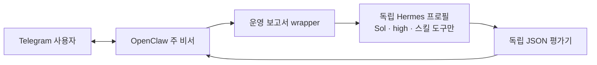

# OpenClaw + Hermes 운영 보고서 파일럿

2026-09-10에는 [운영 진단·개선 확장](OPENCLAW_HERMES_OPERATIONS.md)을 추가했다.
`/skill hermes-operations`와 토요일 10:00 KST 주간 검토는 그 문서를 따른다.
아래 내용은 계속 사용할 수 있는 이벤트 보고서 경로와 최초 비교 실험의 범위를 기록한다.

2026-09-10 정리 검증 보완: `deleteFiles:false`로 보존했던 합성 agent 네 개의 DB 등록과
디렉터리가 Gateway 재시작을 막는 문제가 발견됐다. 해당 등록을 해제하고 파일은 실행 검색
경로 밖에 보존 이동한 뒤 정상 재시작을 확인했다. 이전 `cleanup.ok=true`는 이 재시작 검증까지
포함하지 않았다. 재실행 시 이 경계도 검증해야 한다. [복구 기록](OPENCLAW_HEARTBEAT_RECOVERY_20260910.md).

OpenClaw를 Telegram의 주 비서로 유지하고, Hermes에 **지정한 운영 이벤트 JSON을 보고서로 정리하는 작업 하나**를 위임하는 구성이다. Hermes가 만든 결과는 독립 Python 평가기가 검증하고, 사용자 응답과 최종 전송은 OpenClaw가 맡는다.

이 파일럿은 같은 모델로 절차 저장과 새 작업에서의 재사용을 비교한다. 주 비서의 기본
`gpt-6-astra` / `high` 설정을 보존하고 보고서 작업에 `gpt-5.6-sol` / `high`를 지정한다.
추가 운영 경로도 별도 절차를 사용하며 두 제품의 일반 기억은 자동 동기화하지 않는다.

## 구성과 경계



| 항목 | 현재 범위 |
| --- | --- |
| OpenClaw | 요청 접수, 입력 파일 선택, 결과 설명, 기존 정책에 따른 최종 전송 |
| Hermes | 전달된 이벤트와 `operations-event-report` 절차만 사용해 보고서 생성 |
| 인증 | Hermes 전용 ChatGPT OAuth 로그인. 기존 OpenClaw/Codex 토큰을 복사하지 않음 |
| 모델 | Hermes는 `openai-codex` → `codex_responses` → `gpt-5.6-sol`, 추론 `high` 고정 |
| 전환 | 다른 모델·공급자·API 키로 자동 전환하지 않음 |
| 도구 | `skills_list`, `skill_view`, `skill_manage`만 허용. 반복 단계에서는 스킬 변경 금지 |
| 기억 | Hermes의 일반 기억, 사용자 프로필, 자동 백그라운드 검토 비활성화. OpenClaw 기억과 자동 동기화하지 않음 |
| 외부 작업 | Hermes에 명령 실행, 브라우저, 메신저, 예약 작업, MCP 서버를 제공하지 않음 |
| 산출물 | 모델 결과, 독립 검증, Telegram 실제 전송 영수증을 별도로 취급 |

프로필은 `/Users/jk/.local/share/openclaw-hermes-worker/profile`에 둔다. `CODEX_HOME`은 그 아래 빈 `codex-disabled-import` 디렉터리로 지정하여 기존 Codex 인증 자동 가져오기를 차단한다. 실행 환경에서 상속된 API 키, 프록시, 사용자 지정 엔드포인트와 실행 훅도 제거한다. 별도 프로필은 모델에 노출하는 도구·상태의 분리이며, 운영체제 수준의 컨테이너 격리를 뜻하지는 않는다.

## 무엇을 학습·비교하는가

두 실행기는 다음 두 단계를 **명시적으로 요청**한다.

1. `train`: 합성 이벤트와 전체 출력 계약을 주고, 문제를 해결한 뒤 일반적인 절차·정확한 출력 스키마를 스킬에 저장한다. 입력의 ID·수치·정답은 저장하지 않는다.
2. `repeat`: 새 대화에서 다른 이벤트를 준다. 전체 계약은 다시 제공하지 않고, 저장된 스킬을 실제 도구로 읽어 사용하게 한다. 스킬 파일 해시가 바뀌면 실패다.

OpenClaw는 네이티브 `skill_workshop`의 `create`·`apply`·`read`를 사용한다. Hermes는 네이티브 `skill_manage`·`skill_view`를 사용한다. 스킬 파일이 있다는 사실만으로 재사용 성공을 인정하지 않는다. 성공한 네이티브 도구 호출, 저장된 파일의 해시, 새 입력에 대한 정확한 보고서를 함께 확인한다.

현재 OpenClaw 2026.9.3의 주 에이전트 DB에서도 `autonomousCapture:true`인 applied proposal 1건과 `created`·`evaluation_completed`·`applied` 이벤트가 각 1건 확인됐다. 자동 스킬 포착·평가·적용은 실제 기록이 있으며 Hermes만의 기능으로 볼 수 없다. 이 조회는 해당 스킬의 후속 재사용을 증명하지 않는다. 정기 collection review 실행 기록은 0건이다. [범위 제한 상태 영수증](../reports/openclaw-hermes-pilot-34edaaa239/openclaw-workshop-baseline.json)

이 실험은 평소 대화에서 시스템이 스스로 학습할 시점을 고르는 **자동 학습의 품질**을 검증하지 않는다. Hermes의 자동 검토는 꺼 두었다. OpenClaw에서도 이번 증거는 명시적으로 실행한 Workshop 절차에 한정된다. 모델 가중치를 재훈련하는 작업도 아니다.

## 합성 입력과 정답 규칙

[`agent-pilot-fixtures.py`](../scripts/openclaw/agent-pilot-fixtures.py)가 공개 가능한 합성 데이터만 생성한다. `train`과 `repeat`는 같은 계약을 쓰지만 작업 ID, 이벤트 순서, 건수, 시각 표현이 다르다. 이전 보고서를 그대로 재사용하면 통과하지 못한다.

- `event_id`가 같은 완전히 동일한 행은 제거한다. 내용이 충돌하는 중복은 거부한다.
- 작업별 최신 이벤트는 시간대 오프셋을 UTC로 변환하여 고른다. 동시간이면 `event_id` 사전순으로 마지막 항목을 고른다.
- 실행 완료와 전송 확인을 별도 집계한다. `accepted`이면서 비어 있지 않은 `message_id`가 있어야 전송 확인으로 센다.
- `unknown`은 ID가 있어도 미확인이다. `accepted`인데 영수증이 없으면 역시 미확인이다.
- 전송 실패 시 조치는 `retry_delivery_only`다. 전송 실패를 이유로 원래 작업을 재실행하도록 지시하지 않는다.

생성 디렉터리의 `contract.md`가 정확한 출력 필드와 정렬 규칙을 정의한다. `fixture-manifest.json`은 입력·계약의 SHA-256을 기록하며 평가기는 내장된 variant 기준과도 비교한다. 변경된 입력·계약·manifest, 심볼릭 링크, 중복 JSON 키, 잘못된 타입과 추가 필드를 거부한다. 선택한 variant가 검증 결과와 같은지도 호출자가 확인한다.

## 현재 실제 실행 기록

2026-09-09 KST의 실제 기록이다. 실행별 원본을 보존하며 실패 시도를 성공 행으로 덮어쓰지 않는다. 아래 시간은 Hermes의 `worker-receipt.json` 내부 경과 시간이다. wrapper의 `verification.json.elapsedSeconds`는 시작·검증 시간을 포함하여 약간 더 길다.

| 실행 | 실제 관측 | 독립 보고서 검증 | 경과 시간 | 사용량 | 원본 |
| --- | --- | --- | --- | --- | --- |
| Hermes 초기 train | 어댑터의 스킬 호출 범위와 upstream 스키마 연결 문제로 `SKILL_SCOPE_VIOLATION` | 실패 | 49.982초 | 미제공 | [worker](../reports/openclaw-hermes-pilot-34edaaa239/hermes-train/worker-receipt.json), [검증](../reports/openclaw-hermes-pilot-34edaaa239/hermes-train/verification.json) |
| Hermes train 재시도 | 네이티브 스킬 저장 성공. 도구 호출 중 실패 1회 후 성공한 기록 포함 | 통과 | 127.300초 | `total_tokens` 23,751 / API 4회 | [worker](../reports/openclaw-hermes-pilot-34edaaa239/hermes-train-retry/worker-receipt.json), [검증](../reports/openclaw-hermes-pilot-34edaaa239/hermes-train-retry/verification.json) |
| Hermes 첫 repeat | 실제 `skill_view` 성공. 저장 절차에서 정확한 출력 스키마가 빠져 필드명이 달라짐 | **실패** | 69.426초 | `total_tokens` 10,967 / API 2회 | [worker](../reports/openclaw-hermes-pilot-34edaaa239/hermes-repeat/worker-receipt.json), [검증](../reports/openclaw-hermes-pilot-34edaaa239/hermes-repeat/verification.json) |
| Hermes 절차 보완 train | 기존 스킬 읽기 → 전체 계약 patch → 다시 읽기. 도구 실패 없음 | 통과 | 88.063초 | `total_tokens` 28,948 / API 4회 | [worker](../reports/openclaw-hermes-pilot-34edaaa239/hermes-train-repaired/worker-receipt.json) |
| Hermes 보완 후 repeat | 새 대화에서 `skill_view`, 스킬 해시 동일, 정확한 새 보고서 | **통과** | 34.831초 | `total_tokens` 9,944 / API 2회 | [worker](../reports/openclaw-hermes-pilot-34edaaa239/hermes-repeat-repaired/worker-receipt.json), [검증](../reports/openclaw-hermes-pilot-34edaaa239/hermes-repeat-repaired/verification.json) |
| OpenClaw 첫 실행 | 별도 승인된 2026.9.3 업그레이드와 겹쳐 실행 추적 중단. 소유 세션·에이전트·설정 정리 완료 | 비교 불가 | — | — | [실행·정리 영수증](../reports/openclaw-hermes-pilot-34edaaa239/openclaw/receipt.json) |
| OpenClaw 복구 후 첫 재시도 | 임시 에이전트가 오래된 `openai:default`를 선택하여 추론 전 인증 실패. 정리 완료 | 비교 불가 | — | — | [실행·정리 영수증](../reports/openclaw-hermes-pilot-34edaaa239/openclaw-retry/receipt.json) |
| OpenClaw 임시 에이전트 인증 선택·상속 시도 | 세션 프로필 pin은 저장됐으나 해당 에이전트의 OAuth 준비 확인에서 중단. 추론 호출 없음, 설정·감시기 복구 | 비교 불가 | — | 미제공 | [프로필 pin 시도](../reports/openclaw-hermes-pilot-34edaaa239/openclaw-final/receipt.json), [상속 시도](../reports/openclaw-hermes-pilot-34edaaa239/openclaw-inherited/receipt.json) |
| OpenClaw main train | create → apply → read 성공. 공식 가이드 읽기·현재 진행표시를 인자까지 추가 감사 | **통과** | 141.773초 | `total_tokens` 152,102 | [기능 영수증](../reports/openclaw-hermes-pilot-34edaaa239/openclaw-main/train-functional-acceptance.json) |
| OpenClaw main fresh repeat | native list → read, 새 보고서 정확 일치, 스킬 해시 동일 | **통과** | 57.253초 | `total_tokens` 73,785 | [영수증](../reports/openclaw-hermes-pilot-34edaaa239/openclaw-main-repeat/receipt.json) |

Hermes 전용 OAuth 로그인은 완료되었다. 이는 보고서 재사용 성공이나 Telegram 전송 성공과는 별개다. 특히 첫 repeat는 모델 실행 자체가 종료되었고 스킬도 읽었지만, 보고서가 계약에 맞지 않아 wrapper가 실패로 처리했다. 이에 저장 지시를 보완하여 일반 계약을 스킬에 포함하고 읽어 확인하도록 했다. 보완 후 train과 새로운 repeat가 모두 통과했다. 기존 스킬의 수정이므로 88.063초를 새 설치의 최초 학습 시간으로 해석하지 않는다.

OpenClaw 중단은 같은 조건의 완료된 추론 결과가 아니므로 모델 능력 비교에 사용하지 않는다. 최종 fresh repeat의 실제 수치는 아래에 있으나, 일반적인 속도·비용·품질 우열을 결론 내릴 수 없다. 각 제품이 제공하는 토큰 집계 의미와 캐시 집계도 확인해야 하며, OAuth 사용량을 API 달러 비용으로 환산하지 않는다. 누락된 사용량은 0이 아니라 미제공으로 표시한다. 위 비교 실행은 Telegram으로 결과를 보내지 않는다. 이 집계 자체는 Python만으로도 계산할 수 있으므로, 파일럿 통과가 LLM 위임의 경제성이나 모든 업무에서의 효율 향상을 입증하지는 않는다. 이번 목적은 실제 절차 저장·재사용과 연결 경로 검증이다.

통합 시험 준비 중 관리 CLI가 `sessions.create.idempotencyKey`와 `agent.expectedExistingSessionId`를 각각 거부했다. 두 요청 모두 추론 전에 거부됐고 정확한 임시 key 부재/삭제가 확인됐다. 백엔드 전용 옵션을 제거해 실제 연결 시험을 시작했으며, 앞선 [첫 준비 시도](../reports/openclaw-hermes-pilot-34edaaa239/integration/receipt.json)와 [두 번째 준비 시도](../reports/openclaw-hermes-pilot-34edaaa239/integration-retry/receipt.json)는 보존한다.

## 최종 비교 해석

보완된 절차로 다른 입력을 처리하는 fresh repeat는 두 시스템 모두 통과했다. 아래는 각 1회 관측이며, 설정·로그인·실험 준비 시간은 제외한다.

| 실행 경로 | 경과 시간 | 비캐시 입력 | 캐시 입력 | 출력 | 보고된 총 토큰 |
| --- | ---: | ---: | ---: | ---: | ---: |
| OpenClaw main → Sol/high | 57.253초 | 19,980 | 52,352 | 1,453 | 73,785 |
| 최소 도구 Hermes → Sol/high | 34.831초 | 5,161 | 3,840 | 943 | 9,944 |
| Astra → Hermes → 응답 반환 | 69.555초 | 전체 미제공 | 전체 미제공 | 전체 미제공 | 전체 미제공 |

마지막 행의 내부 Hermes는 35.566초·9,970토큰이었지만 외부 Astra 사용량 전체를 확보하지 못했으므로 합계 비용을 추정하지 않는다. **이 사례에서는 결합 호출이 OpenClaw 단독보다 느렸다.** Hermes 단독의 작은 문맥·도구 집합과 OpenClaw 주 비서의 전체 운영 문맥은 조건이 다르므로 프레임워크 자체의 속도·비용 우열로 일반화하지 않는다. Hermes의 88.063초 보완 train은 기존 스킬 patch이며 OpenClaw의 최초 create/apply와도 동일 출발점이 아니다.

현재 채택 범위는 **OpenClaw를 기본으로 유지하고, 사용자가 지정한 반복 보고서만 Hermes에 선택적으로 위임**하는 것이다. 두 제품 모두 스킬 학습이 있으므로, 결합의 가치는 대화·진행·전송을 맡는 주 비서와 작은 입력·도구 범위의 작업 실행기를 나누는 데 있다. 다른 업무에 확대하기 전에는 해당 입력과 평가기로 다시 확인한다.

OpenClaw 최초 main train의 기본 엄격 감사는 `read`·`progress_card` 때문에 실패했다. 원본은 보존했고, 실제 호출이 공식 스킬 작성 가이드 하나와 현재 작업의 진행 계획뿐임을 확인한 뒤 보고서·native create/apply/read를 별도로 검증했다. 모델 학습을 다시 실행하지 않았다. 이후 main 검증 모드에는 이 제한된 보조 호출만 인자 감사와 함께 반영했다.

## 실제 연결 검증

설치한 스킬은 `skills.status`의 main 목록에서 `eligible:true`, `disabled:false`, `source:openclaw-workspace`로 확인됐다. 이어 main의 새 incognito 대화에서 기본 **Astra/high**가 `read`·`exec`·`process`를 실제 성공시키고, 설치한 Hermes wrapper의 성공 JSON을 반환했다. Hermes는 **Sol/high**로 `skill_view`를 사용했으며, 원래 학습 스킬을 변경하지 않고 새 보고서를 독립 평가기와 정확히 일치시켰다.

- OpenClaw 전체 실행: 69.555초, `rerouted:false`.
- 내부 Hermes: 35.566초, `total_tokens` 9,970, API 2회.
- config·입력·설치 wrapper·등록 스킬 SHA-256 동일, incognito 세션 정확 삭제 및 archive 없음.
- [기능 연결 영수증](../reports/openclaw-hermes-pilot-34edaaa239/integration-live/functional-acceptance.json), [네이티브 종료 응답](../reports/openclaw-hermes-pilot-34edaaa239/integration-live/terminal.json).

사후 감사 스크립트가 `chat.history`에 `messageId` 없이 `sessionId`를 주어 조회가 거부됐다. 현재 서버 소스의 `sessionId requires messageId` 조건과 기록된 요청 SHA-256을 대조해 원인을 확인했다. 따라서 **개별 명령 인자 전체 감사는 미확인**이다. 원래 엄격 smoke의 실패 기록은 유지하고, 위 기능 연결 성공을 별도 영수증으로 검증했다. 감사 증거를 얻기 위해 같은 모델 작업을 다시 실행하지 않았다. OpenClaw는 기존 주 비서 권한으로 동작하며 exec만 허용되는 별도 sandbox라는 주장은 하지 않는다. 제한된 모델 도구 집합은 Hermes worker에 적용된다.

## Telegram에서 사용

같은 이벤트 계약의 JSON 파일을 첨부한 뒤 다음처럼 요청한다.

```text
/skill hermes-operations-report 첨부한 JSON을 보고서로 정리해줘
```

이 연결은 운영 이벤트 보고서 한 종류에 한정된다. 일반 코딩·검색·문서 요청은 기존 OpenClaw 흐름을 따른다. Hermes로 넘기는 입력은 사용자가 지정한 이벤트 파일이며, 원래 대화 전체나 장기 기억을 자동으로 전달하지 않는다.

연결을 중지할 때는 활성 workspace의 `skills/hermes-operations-report` 등록만 비활성화하면 된다. 별도 Hermes 서비스나 Telegram 폴링 프로세스는 설치하지 않았으므로 Gateway 교체나 주 대화 삭제가 필요하지 않다. 인증·학습 절차·실행 기록은 별도 로컬 프로필에 남으며 이를 지우는 작업은 별도 범위다.

## 신규 설치와 독립 인증

현재 설치기는 Hermes **0.21.1**, 커밋 **`ead7e91dabf1e963796ec834b196984a2fa44ff4`**에 고정되어 있다. `/opt/homebrew/opt/python@3.11/bin/python3.11`, `/opt/homebrew/bin/uv`, Git이 필요하다. 설치기는 검토된 커밋과 추적 파일의 변경 여부를 확인하고, 별도 clone에서 `uv sync --frozen --no-dev --no-default-groups`를 실행한다.

아래는 **새 설치에만** 사용하는 절차다. 현재 설치·인증이 있으므로 정상 운영 중 다시 실행하지 않는다. 설치기는 기존 설치 디렉터리를 덮어쓰지 않으며 `auth`도 기존 인증이 있으면 중복 로그인을 거부한다.

```bash
cd /Users/jk/projects/python/my-local-agent
git clone https://github.com/NousResearch/hermes-agent.git /private/tmp/hermes-reviewed-source
git -C /private/tmp/hermes-reviewed-source checkout --detach ead7e91dabf1e963796ec834b196984a2fa44ff4
python3 scripts/openclaw/install-hermes-worker.py install --source /private/tmp/hermes-reviewed-source
python3 scripts/openclaw/install-hermes-worker.py auth
python3 scripts/openclaw/install-hermes-worker.py configure
```

`auth`는 전용 프로필의 독립 ChatGPT 장치 코드 로그인을 시작한다. 기존 인증 파일을 읽어서 붙여넣거나 복사하지 않는다. `configure`는 초기 생성된 설정·스킬·훅 등을 `startup-backup`에 보존하고 제한된 작업 설정을 적용하며, 인증 파일 바이트가 그대로인지 확인한다. 다른 공급자, 다중 인증 정체성, 가져온 인증, 예상하지 않은 프로필 설정은 거부한다.

`installation.json`에는 고정 커밋과 lock 해시, `configuration.json`에는 적용된 설정 해시와 인증 보존 확인을 남긴다. 이 파일들과 프로필·실행 산출물은 로컬 상태로 보관하며 Git에 추가하지 않는다.

## 실행과 검증

프로젝트 디렉터리에서 아래처럼 새 합성 입력 디렉터리를 만든다. 예시 경로가 이미 있으면 새 이름을 사용한다. symlink를 따라가지 않으므로 macOS 임시 경로는 `/tmp` 대신 `/private/tmp`처럼 실제 절대 경로를 사용한다.

```bash
python3 scripts/openclaw/agent-pilot-fixtures.py prepare --output-dir /private/tmp/agent-pilot-train-example --variant train
python3 scripts/openclaw/agent-pilot-fixtures.py prepare --output-dir /private/tmp/agent-pilot-repeat-example --variant repeat
```

처음 절차를 만들거나 의도적으로 보완할 때만 `--phase train`을 사용한다. `train`은 기존 절차를 변경할 수 있다. 각 출력 디렉터리는 새 경로여야 한다.

```bash
python3 scripts/openclaw/hermes-operations-report.py --input-file /private/tmp/agent-pilot-train-example/events.json --output-dir /Users/jk/.local/share/openclaw-hermes-worker/runs/train-example --phase train
python3 scripts/openclaw/hermes-operations-report.py --input-file /private/tmp/agent-pilot-repeat-example/events.json --output-dir /Users/jk/.local/share/openclaw-hermes-worker/runs/repeat-example --phase repeat
python3 scripts/openclaw/agent-pilot-fixtures.py verify --run-dir /private/tmp/agent-pilot-repeat-example --report /Users/jk/.local/share/openclaw-hermes-worker/runs/repeat-example/report.json
```

일반 운영 보고서는 `--phase repeat`가 기본이다. 합성 fixture 이외의 파일도 같은 이벤트 계약을 따르면 wrapper가 독립 계산하여 검증한다. 이 경우 `agent-pilot-fixtures.py verify`는 고정 합성 fixture 전용이므로 사용하지 않고 wrapper의 검증 영수증을 확인한다.

실행 결과의 구분은 다음과 같다.

| 파일·신호 | 의미 |
| --- | --- |
| wrapper exit 0 및 stdout의 `ok:true` | 해당 실행의 도구·스킬·보고서 검증 통과 |
| `worker-receipt.json` | 실제 모델·공급자·응답 모델, 추론 수준, 네이티브 도구, 스킬 해시, 사용량, 종료 상태 |
| `verification.json`의 `reportVerified:true` | 독립 평가기와 정확히 일치한 보고서 |
| `report.json` | 검증을 통과한 구조화 보고서. 실패 실행에서는 성공 산출물로 생성하지 않음 |
| `telegramDelivered:false` | Hermes가 Telegram으로 보내지 않았음. 이후 OpenClaw 전송에는 별도 실제 영수증 필요 |

프로필은 한 번에 한 실행만 허용한다. Hermes는 12회 반복·240초의 실행 한도를 두고 wrapper는 280초 한도로 기다린다. timeout·취소 시 프로세스 그룹을 정리한다. 실행이나 파싱이 실패해도 가능한 경우 검증 영수증을 남기며, 표준 오류에 모델 원문·인증값을 출력하지 않는다. 오류가 나면 원본 영수증을 보존하고 원인을 해결한 다음 새 출력 디렉터리에서 재시도한다.

## OpenClaw 측 연결과 비교 실행

사용자용 연결 절차는 [`HERMES_OPERATIONS_REPORT_SKILL.md`](../scripts/openclaw/templates/HERMES_OPERATIONS_REPORT_SKILL.md)에 있다. 사용자가 Hermes 운영 보고서를 명시적으로 요청할 때 입력 파일 하나를 wrapper에 전달한다. template의 설치본 호출 경로는 `/Users/jk/.local/share/openclaw-hermes-worker/bin/hermes-operations-report.py`이며, 저장소에서 직접 실행할 때는 위 명령을 사용한다. runtime 설치 명령 자체가 OpenClaw 스킬을 등록하지는 않는다.

wrapper 설치본은 인접한 `agent-pilot-fixtures.py`, `install-hermes-worker.py`, `hermes-report-worker.py`를 import하거나 실행하므로 함께 배치해야 한다. 보고서의 새 입력 재사용 검증을 통과한 뒤 네 파일을 `bin/`에 함께 설치하고, 활성 workspace의 `skills/hermes-operations-report/SKILL.md`를 등록했다. 기존 config를 `deployment-backup-34edaaa239/openclaw.json`에 백업했고 config 바이트가 변하지 않았음을 확인했다. `deployment.json`에 소스·설치본·학습 스킬 해시와 각 검증 상태를 기록한다. OpenClaw에서 시작하는 실제 호출 경로는 별도 검증한다.

OpenClaw 자체의 Workshop 비교는 아래 전용 실행기가 수행한다. 임시 에이전트·workspace·대화를 만들며, 기존 주 비서의 대화·기억을 읽어 과제에 넣지 않는다. 설정 변경 전 idle 상태를 세 번 확인하고 백업을 남긴다. 실행 후에는 자신이 만든 에이전트·대화와 소유한 설정 변경만 정리하며 합성 산출물은 보존한다.

```bash
python3 scripts/openclaw/openclaw-learning-pilot.py --run-dir /private/tmp/openclaw-learning-example --model gpt-5.6-sol
```

중단된 실행의 정리만 재개하려면 **그 실행의 원래 경로**와 `--cleanup-only`를 사용한다. 새 모델 실행을 시작하거나 다른 에이전트를 정리하는 명령이 아니다.

```bash
python3 scripts/openclaw/openclaw-learning-pilot.py --run-dir /private/tmp/openclaw-learning-example --cleanup-only
```

`receipt.json`의 본 실행 성공, `cleanup.ok`, 주 비서 보존 확인을 각각 확인한다. 실행 중 Gateway·패키지 업그레이드와 겹친 결과는 동일 조건의 모델 비교로 집계하지 않는다. 설정이 동시에 바뀌어 자동 복원이 안전하지 않으면 원래 설정을 통째로 덮어쓰지 않고 정리 보류 항목을 기록한다.

## 인증 범위와 OpenClaw 비교 재현

현재 OpenClaw OAuth는 main 로컬 인증 저장소에 있다. 공유 인증 저장소의 소유 위치가 `state-db`여서, 업그레이드 호환용 `authInheritance.agentId` 힌트는 main 로컬 OAuth를 다른 에이전트에 공개하지 않는다. 세션의 `@profileId` 선택도 인증의 가시 범위를 넓히지 않는다. 따라서 임시 에이전트 준비 실패를 학습 기능의 실패로 세지 않았으며, 자격 증명 복사나 공유 범위 변경도 하지 않았다.

현재 설치에서의 직접 학습 검증은 명시적 main 모드를 사용한다. 새 합성 대화 두 개와 native Workshop을 사용하며 config와 기존 대화는 바꾸지 않는다. 일반 절차 스킬은 사용자를 위해 보존한다. 아래 명령은 새 환경의 최초 검증용이며, 현재는 이미 같은 이름의 스킬이 있으므로 덮어쓰기를 거부한다.

```bash
python3 scripts/openclaw/openclaw-learning-pilot.py --run-dir /private/tmp/openclaw-main-learning-example --use-existing-main
```

main 모드는 기존 정책·도구 구성을 유지한다. 따라서 공식 `skill-creator/SKILL.md` 읽기, 현재 작업의 `progress_card` 계획, repeat에서 해시로 확인한 학습 스킬 읽기를 정확한 인자 범위로 감사한다. 다른 파일이나 명령 실행은 해당 검증에서 허용하지 않는다. 기본 임시 에이전트 모드의 엄격한 도구 검사는 유지한다.

## 최종 운영 상태와 전송

최종 `verify-gateway.sh --telegram --json`은 2026.9.3, static/live 통과, Gateway ready, Telegram polling을 확인했다. 감시기는 복구되어 마지막 exit code 0이다. main의 기존 세션 ID와 transcript 건수는 유지됐고, 모든 시험 대화와 임시 에이전트 등록은 정리됐다. 두 검증된 일반 절차 스킬은 각자의 프로필에 보존한다. [최종 인수 기록](../reports/openclaw-hermes-pilot-34edaaa239/acceptance.json)

**Telegram 사용 안내 전송까지 완료했다.** 최초에는 자동 승인 검토가 운영 정보와 로컬 경로 전송의 명시적 승인 부족을 이유로 거절했다. 이후 사용자가 남은 Hermes 작업을 명시적으로 승인하여 2026-09-10 06:12:49 KST에 파일 첨부 방법과 `/skill hermes-operations-report` 명령을 소유자 Telegram 대화로 한 번 보냈다. 서버 응답의 `payload.ok=true`, 수신 대상 일치, `messageId=155`를 확인했다. 휴대전화에서 열람했는지는 관찰하지 않았으며, 이 영수증은 사용 안내 전송에 대한 것으로 실제 사용자 보고서의 Telegram 전송 검증을 뜻하지 않는다. [전송 영수증](../reports/openclaw-hermes-pilot-34edaaa239/telegram-guide-delivery.json)

9월 9일 인수 기록은 당시 스냅샷으로 보존한다. 이번 후속 완료 기록에서 승인 대기 항목이 없음을 확인하며, 기존 명령 인자 전체 감사의 증거 부족은 그대로 표시한다. [후속 완료 기록](../reports/openclaw-hermes-pilot-34edaaa239/acceptance-closure-20260910.json)

## 로컬 회귀 검증

91개 파일럿 회귀 시험과 기존 Telegram 정책 시험 11개, 총 102개가 통과했다. 아래 검증은 외부 모델·Telegram·실제 인증·설치를 실행하지 않는다. timeout 테스트에서는 임시 합성 하위 프로세스를 생성한 뒤 정리 여부를 검사한다.

```bash
python3 scripts/openclaw/test-agent-pilot-fixtures.py
python3 scripts/openclaw/test-install-hermes-worker.py
python3 scripts/openclaw/test-hermes-report-worker.py
python3 scripts/openclaw/test-hermes-operations-report.py
python3 scripts/openclaw/test-openclaw-learning-pilot.py
```

로컬 테스트 통과, 실제 모델 실행 종료, 절차 재사용 검증, 최종 Telegram 수신 증거는 서로 다른 결과다. 채택 후에도 Hermes는 지정한 보고서 작업만 담당하며, 별도 검증 없이 일반 기억 동기화나 다른 도구·업무로 범위를 넓히지 않는다.
